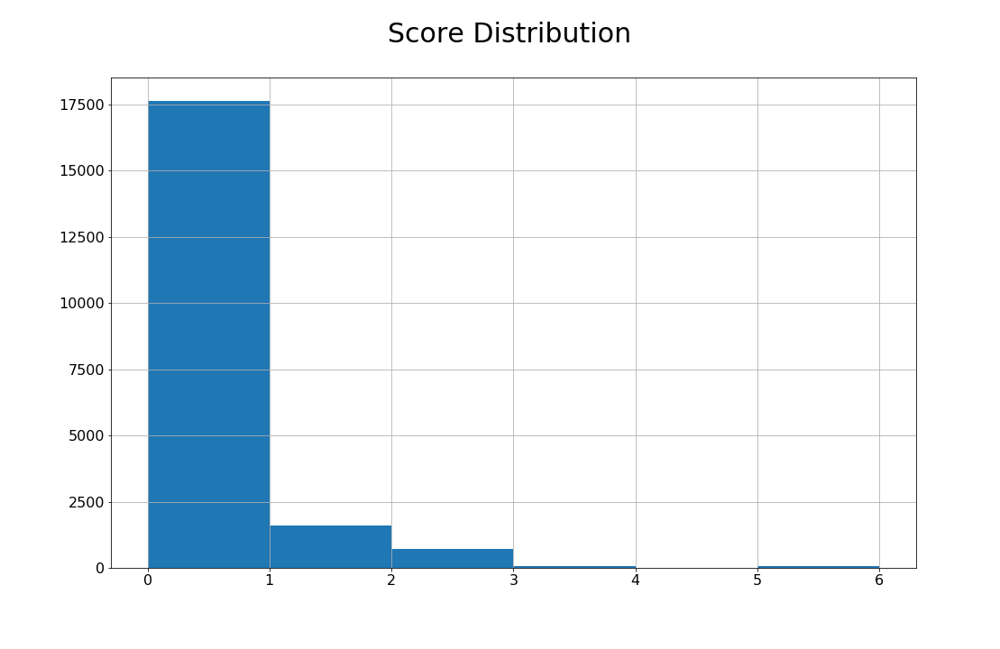
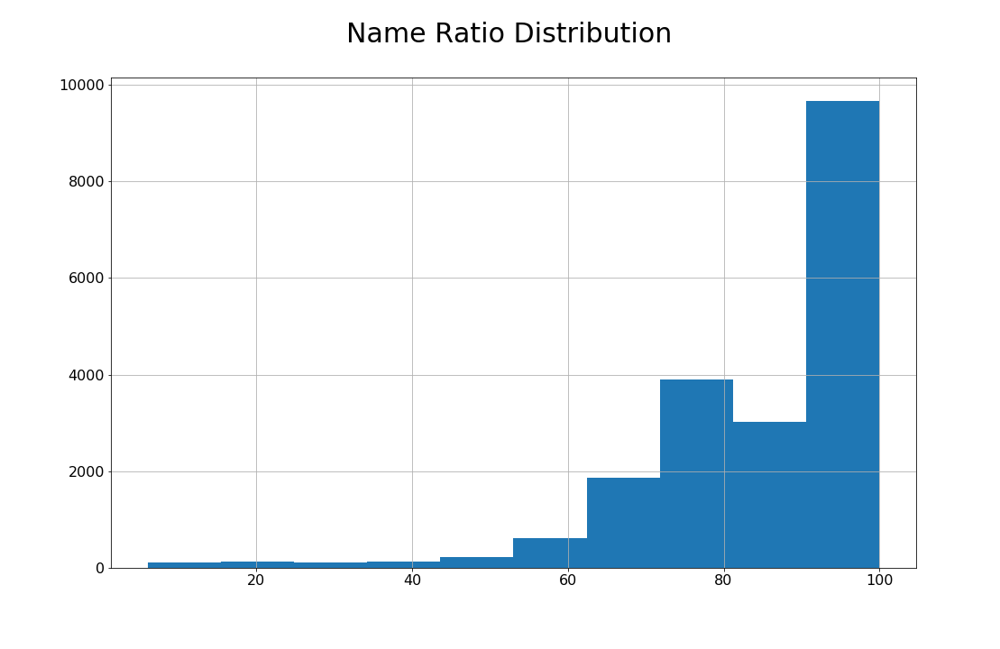

This Python code builds a linkage between IBES data (containing information on company earnings and analysts forecasts) and CRSP data (containing price and return information). It builds the linkage in two layers:

- linking through CUSIPs
- linking through Tickers

As CUSIPs are more reliable company identifiers, we first try to match as much as possible through it. For the remaining ones that are not matched through CUSIP, we turn to TICKER as last resort. To impose additional layer of quality check, I add a company name matching layer on top of matching through CUSIPs and TICKERs. Name matching is done through FuzzyWuzzy package, but there can be many other fuzzy name matching methods.

<div class="btn-row"><a class="primary" href="https://drive.google.com/file/d/10y_k6M6r_br9lhe14E4ZN6IUFgC5tMnr/view?usp=sharing">Full Code</a></div>

First, import the Python packages needed for this exercise and establish connection with WRDS server.

```python
#####################################
# ICLINK: Link CRSP and IBES        #
# Qingyi (Freda) Song Drechsler     #
# Date: June 2019                   #
# Updated: June 2020                #
#####################################

# This program replicates the SAS macro ICLINK 
# to create a linking table between CRSP and IBES
# Output is a score reflecting the quality of the link
# Score = 0 (best link) to Score = 6 (worst link)
# 
# More explanation on score system:
# - 0: BEST match: using (cusip, cusip dates and company names)       
#          or (exchange ticker, company names and 6-digit cusip)     
# - 1: Cusips and cusip dates match but company names do not match    
# - 2: Cusips and company names match but cusip dates do not match    
# - 3: Cusips match but cusip dates and company names do not match    
# - 4: tickers and 6-digit cusips match but company names do not match   
# - 5: tickers and company names match but 6-digit cusips do not match        
# - 6: tickers match but company names and 6-digit cusips do not match        

import wrds
import pandas as pd
import numpy as np
from fuzzywuzzy import fuzz

###################
# Connect to WRDS #
###################
conn=wrds.Connection()
```

We start the linking exercise through CUSIP matching.

The block of code below extracts company identifying information from IBES, including CUSIP, TICKER, company names, and date ranges.

```python
#########################
# Step 1: Link by CUSIP #
#########################

# 1.1 IBES: Get the list of IBES Tickers for US firms in IBES
_ibes1 = conn.raw_sql("""
                      select ticker, cusip, cname, sdates from ibes.id
                      where usfirm=1 and cusip != ''
                      """, date_cols=['sdates'])

# Create first and last 'start dates' for a given cusip
# Use agg min and max to find the first and last date per group
# then rename to fdate and ldate respectively

_ibes1_date = _ibes1.groupby(['ticker','cusip']).sdates.agg(['min', 'max'])\
.reset_index().rename(columns={'min':'fdate', 'max':'ldate'})

# merge fdate ldate back to _ibes1 data
_ibes2 = pd.merge(_ibes1, _ibes1_date,how='left', on =['ticker','cusip'])
_ibes2 = _ibes2.sort_values(by=['ticker','cusip','sdates'])

# keep only the most recent company name
# determined by having sdates = ldate
_ibes2 = _ibes2.loc[_ibes2.sdates == _ibes2.ldate].drop(['sdates'], axis=1)
```

We repeat the same exercise on the CRSP front, to extract PERMNO, CUSIP, company names and date ranges.

```python
# 1.2 CRSP: Get all permno-ncusip combinations
_crsp1 = conn.raw_sql("""
                      select permno, ncusip, comnam, namedt, nameenddt
                      from crsp.stocknames
                      where ncusip != ''
                      """, date_cols=['namedt', 'nameenddt'])
# first namedt
_crsp1_fnamedt = _crsp1.groupby(['permno','ncusip']).namedt.min().reset_index()

# last nameenddt
_crsp1_lnameenddt = _crsp1.groupby(['permno','ncusip']).nameenddt.max().reset_index()

# merge both 
_crsp1_dtrange = pd.merge(_crsp1_fnamedt, _crsp1_lnameenddt, \
                          on = ['permno','ncusip'], how='inner')

# replace namedt and nameenddt with the version from the dtrange
_crsp1 = _crsp1.drop(['namedt'],axis=1).rename(columns={'nameenddt':'enddt'})
_crsp2 = pd.merge(_crsp1, _crsp1_dtrange, on =['permno','ncusip'], how='inner')

# keep only most recent company name
_crsp2 = _crsp2.loc[_crsp2.enddt ==_crsp2.nameenddt].drop(['enddt'], axis=1)
```

Next step is to link both through matching CUSIPs.

```python
# 1.3 Create CUSIP Link Table

# Link by full cusip, company names and dates
_link1_1 = pd.merge(_ibes2, _crsp2, how='inner', left_on='cusip', right_on='ncusip')\
.sort_values(['ticker','permno','ldate'])

# Keep link with most recent company name
_link1_1_tmp = _link1_1.groupby(['ticker','permno']).ldate.max().reset_index()
_link1_2 = pd.merge(_link1_1, _link1_1_tmp, how='inner', on =['ticker', 'permno', 'ldate'])
```

To guarantee that the matched pairs are indeed the same company, additional layer sanity check of company name matching is added below.

```python
# Calculate name matching ratio using FuzzyWuzzy

# Note: fuzz ratio = 100 -> match perfectly
#       fuzz ratio = 0   -> do not match at all

# Comment: token_set_ratio is more flexible in matching the strings:
# fuzz.token_set_ratio('AMAZON.COM INC',  'AMAZON COM INC')
# returns value of 100

# fuzz.ratio('AMAZON.COM INC',  'AMAZON COM INC')
# returns value of 93

_link1_2['name_ratio'] = _link1_2.apply(lambda x: fuzz.token_set_ratio(x.comnam, x.cname), axis=1)

# Note on parameters:
# The following parameters are chosen to mimic the SAS macro %iclink
# In %iclink, name_dist < 30 is assigned score = 0
# where name_dist=30 is roughly 90% percentile in total distribution
# and higher name_dist means more different names.
# In name_ratio, I mimic this by choosing 10% percentile as cutoff to assign
# score = 0

# 10% percentile of the company name distance
name_ratio_p10 = _link1_2.name_ratio.quantile(0.10)
```

With the name_ratio created, one needs to make a subjective call as to what degree of matched company names is considered "good" match. In the code below, I used 10% as cut off point, and apply that in the function "score1" when assigning quality scores to the matched links based on the consideration of quality of the company name matching, consistency of date ranges from both IBES and CRSP sources.

```python
# Function to assign score for companies matched by:
# full cusip and passing name_ratio
# or meeting date range requirement

def score1(row):
    if (row['fdate']<=row['nameenddt']) & (row['ldate']>=row['namedt']) & (row['name_ratio'] >= name_ratio_p10):
        score = 0
    elif (row['fdate']<=row['nameenddt']) & (row['ldate']>=row['namedt']):
        score = 1
    elif row['name_ratio'] >= name_ratio_p10:
        score = 2
    else:
        score = 3
    return score

# assign size portfolio
_link1_2['score']=_link1_2.apply(score1, axis=1)
_link1_2 = _link1_2[['ticker','permno','cname','comnam','name_ratio','score']]
_link1_2 = _link1_2.drop_duplicates()
```

Let's inspect the distribution of the score created by fuzzy name matching:

```python
_link1_2.groupby(['score']).score.count()
```

```text
score
0    17631
1     1619
2      669
3       79
Name: score, dtype: int64
```

The second part of the linking exercises uses TICKER as linking key among the stocks that do not match through the CUSIP exercise above. We start by identifying the stocks that are not matched.

```python
##########################
# Step 2: Link by TICKER #
##########################

# Find links for the remaining unmatched cases using Exchange Ticker 

# Identify remaining unmatched cases 
_nomatch1 = pd.merge(_ibes2[['ticker']], _link1_2[['permno','ticker']], on='ticker', how='left')
_nomatch1 = _nomatch1.loc[_nomatch1.permno.isnull()].drop(['permno'], axis=1).drop_duplicates()

# Add IBES identifying information

ibesid = conn.raw_sql(""" select ticker, cname, oftic, sdates, cusip from ibes.id """, date_cols=['sdates'])
ibesid = ibesid.loc[ibesid.oftic.notna()]

_nomatch2 = pd.merge(_nomatch1, ibesid, how='inner', on=['ticker'])

# Create first and last 'start dates' for Exchange Tickers
# Label date range variables and keep only most recent company name

_nomatch3 = _nomatch2.groupby(['ticker', 'oftic']).sdates.agg(['min', 'max'])\
.reset_index().rename(columns={'min':'fdate', 'max':'ldate'})

_nomatch3 = pd.merge(_nomatch2, _nomatch3, how='left', on=['ticker','oftic'])

_nomatch3 = _nomatch3.loc[_nomatch3.sdates == _nomatch3.ldate]
```

We then extract identifying information from CRSP.

```python
# Get entire list of CRSP stocks with Exchange Ticker information

_crsp_n1 = conn.raw_sql(""" select ticker, comnam, permno, ncusip, namedt, nameenddt
                            from crsp.stocknames """, date_cols=['namedt', 'nameenddt'])

_crsp_n1 = _crsp_n1.loc[_crsp_n1.ticker.notna()].sort_values(by=['permno','ticker','namedt'])

# Arrange effective dates for link by Exchange Ticker

_crsp_n1_namedt = _crsp_n1.groupby(['permno','ticker']).namedt.min().reset_index().rename(columns={'min':'namedt'})
_crsp_n1_nameenddt = _crsp_n1.groupby(['permno','ticker']).nameenddt.max().reset_index().rename(columns={'max':'nameenddt'})

_crsp_n1_dt = pd.merge(_crsp_n1_namedt, _crsp_n1_nameenddt, how = 'inner', on=['permno','ticker'])

_crsp_n1 = _crsp_n1.rename(columns={'namedt': 'namedt_ind', 'nameenddt':'nameenddt_ind'})

_crsp_n2 = pd.merge(_crsp_n1, _crsp_n1_dt, how ='left', on = ['permno','ticker'])

_crsp_n2 = _crsp_n2.rename(columns={'ticker':'crsp_ticker'})
_crsp_n2 = _crsp_n2.loc[_crsp_n2.nameenddt_ind == _crsp_n2.nameenddt].drop(['namedt_ind', 'nameenddt_ind'], axis=1)
```

Using the exchange TICKERs as keys, try merging the unmatched stocks. Similar to the approach in the CUSIP matching stage, on top of TICKER matching, I include additional layer of check by comparing linked pair's company names information, and assign a cutoff score at 10% of the distribution.

```python
# Merge remaining unmatched cases using Exchange Ticker 
# Note: Use ticker date ranges as exchange tickers are reused overtime

_link2_1 = pd.merge(_nomatch3, _crsp_n2, how='inner', left_on=['oftic'], right_on=['crsp_ticker'])
_link2_1 = _link2_1.loc[(_link2_1.ldate>=_link2_1.namedt) & (_link2_1.fdate<=_link2_1.nameenddt)]

# Score using company name using 6-digit CUSIP and company name spelling distance
_link2_1['name_ratio'] = _link2_1.apply(lambda x: fuzz.token_set_ratio(x.comnam, x.cname), axis=1)

_link2_2 = _link2_1
_link2_2['cusip6'] = _link2_2.apply(lambda x: x.cusip[:6], axis=1)
_link2_2['ncusip6'] = _link2_2.apply(lambda x: x.ncusip[:6], axis=1)

# Score using company name using 6-digit CUSIP and company name spelling distance

def score2(row):
    if (row['cusip6']==row['ncusip6']) & (row['name_ratio'] >= name_ratio_p10):
        score = 0
    elif (row['cusip6']==row['ncusip6']):
        score = 4
    elif row['name_ratio'] >= name_ratio_p10:
        score = 5
    else:
        score = 6
    return score

# assign size portfolio
_link2_2['score']=_link2_2.apply(score2, axis=1)

# Some companies may have more than one TICKER-PERMNO link
# so re-sort and keep the case (PERMNO & Company name from CRSP)
# that gives the lowest score for each IBES TICKER 

_link2_2 = _link2_2[['ticker','permno','cname','comnam', 'name_ratio', 'score']].sort_values(by=['ticker','score'])
_link2_2_score = _link2_2.groupby(['ticker']).score.min().reset_index()

_link2_3 = pd.merge(_link2_2, _link2_2_score, how='inner', on=['ticker', 'score'])
_link2_3 = _link2_3[['ticker','permno','cname','comnam','score']].drop_duplicates()
```

Last step is to combine the linking results from CUSIP and TICKER. As this linking table can potentially be called upon often from other research programs, it is a good idea to store it as a static table for easy future retrieving.

```python
#####################################
# Step 3: Finalize LInks and Scores #
#####################################

iclink = _link1_2.append(_link2_3)

# Storing iclink for other program usage
import pickle as pkl

with open('iclink.pkl', 'wb') as f:
    pkl.dump(iclink, f)
```

Below are two figures displaying the distribution of the linking score and "name_ratio" from this code, which give more intuition on how well these two databases are linked.




