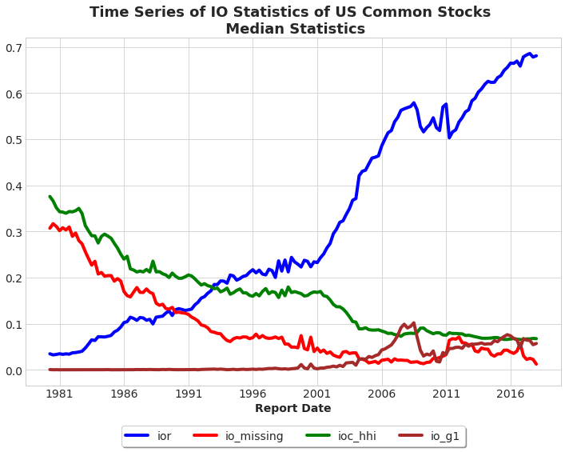
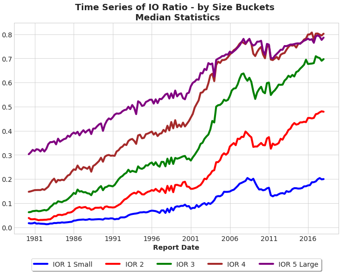

[Chen, Hong and Stein (2002)](https://www.sciencedirect.com/science/article/pii/S0304405X02002234) studies the relationship between institutional ownership breadth and underlying stock returns. This set of code replicates this exercise using Thomson Reuters 13F data. The output of this code includes breadth of ownership, institutional ownership relative to total shares, concentration of ownership, etc.

<div class="btn-row"><a class="primary" href="https://drive.google.com/file/d/11aIZXvQepTWIUwSllXOIYF5lS1ynxCOm/view?usp=sharing">Full Code</a></div>

Start by importing Python packages and establishing connection to WRDS server:

```python
##################################################
# Calculate IO, Concentration and Breadth Ratios #
# Qingyi (Freda) Song Drechsler                  #
# Date: November 2018                            #
# Updated: June 2020                             #
##################################################

import pandas as pd
import numpy as np
import wrds
import datetime as dt
from pandas.tseries.offsets import *
import matplotlib.pyplot as plt

###################
# Connect to WRDS #
###################
conn=wrds.Connection()
```

```python
######################################
# Step 1                             #
# CRSP Block                         #
######################################

# set sample date range
begdate = '03/01/1980'
enddate = '12/31/2017'

# sql similar to crspmerge macro

crsp_m = conn.raw_sql(f"""
                      select a.permno, a.date, 
                      a.ret, a.vol, a.shrout, a.prc, a.cfacpr, a.cfacshr
                      from crsp.msf as a
                      left join crsp.msenames as b
                      on a.permno=b.permno
                      and b.namedt<=a.date
                      and a.date<=b.nameendt
                      where a.date between '{begdate}' and '{enddate}'
                      and b.shrcd between 10 and 11
                      """, date_cols=['date']) 

# change variable format to int
crsp_m[['permno']]= crsp_m[['permno']].astype(int)

# get month and quarter-end dates
crsp_m['mdate']=crsp_m['date']+pd.offsets.MonthEnd(0)
crsp_m['qdate']=crsp_m['date']+pd.offsets.QuarterEnd(0)

# calculate adjusted price, total shares and market cap
crsp_m['p']=crsp_m['prc'].abs()/crsp_m['cfacpr'] # price adjusted
crsp_m['tso']=crsp_m['shrout']*crsp_m['cfacshr']*1e3 # total shares out adjusted
crsp_m['me'] = crsp_m['p']*crsp_m['tso']/1e6 # market cap in $mil

# keep only relevant columns
crsp_m = crsp_m[['permno','mdate','qdate','date','cfacshr', 'p', 'tso','me']]

# For each stock(permno), each quarter (qdate), find the last monthly date (mdate)
qend = crsp_m[['permno','mdate','qdate']].groupby(['permno','qdate'])['mdate'].max().reset_index()

# Merge back to keep last monthly observation for each quarter
crsp_qend = pd.merge(crsp_m, qend, how='inner', on=['permno','qdate','mdate'])
```

```python
######################################
# Step 2                             #
# Merge TR 13f s34type1 and s34type3 #
######################################

fst_vint = conn.raw_sql("""
                      select rdate, fdate, mgrno, mgrname
                      from tfn.s34type1 
                      """, date_cols=['rdate','fdate']) 

# Keep first vintage with holding data for each mgrno-rdate combo
min_fdate = fst_vint.groupby(['mgrno','rdate'])['fdate'].min().reset_index()

# Merge back with the fst_vint data to keep only the first vintage records
fst_vint = pd.merge(fst_vint, min_fdate, how='inner', on=['mgrno','rdate','fdate'])

# Sort by mgrno and rdate and create lag_rdate to calculate gap
fst_vint = fst_vint.sort_values(['mgrno', 'rdate'])
fst_vint['lag_rdate']=fst_vint.groupby(['mgrno'])['rdate'].shift(1)

# Number of quarters gap between rdate and lag_rdate
fst_vint['rdate_year']=fst_vint.rdate.dt.year
fst_vint['rdate_qtr'] =fst_vint.rdate.dt.quarter

fst_vint['lag_rdate_year']=fst_vint.lag_rdate.dt.year
fst_vint['lag_rdate_qtr'] =fst_vint.lag_rdate.dt.quarter

fst_vint['qtr'] = (fst_vint.rdate_year - fst_vint.lag_rdate_year)*4 + (fst_vint.rdate_qtr - fst_vint.lag_rdate_qtr)


# label first_report flag
fst_vint['first_report'] = ((fst_vint.qtr.isnull()) | (fst_vint.qtr>=2))
fst_vint = fst_vint.drop(['qtr'],axis=1)

# Last report by manager or missing 13F reports in the next quarter(s)
fst_vint = fst_vint.sort_values(['mgrno','rdate'], ascending=[True, False])
fst_vint['lead_rdate']=fst_vint.groupby(['mgrno'])['rdate'].shift(1)

# Number of quarters gap between lead_rdate and rdate
fst_vint['lead_rdate_year']=fst_vint.lead_rdate.dt.year
fst_vint['lead_rdate_qtr'] =fst_vint.lead_rdate.dt.quarter

fst_vint['qtr'] = (fst_vint.lead_rdate_year - fst_vint.rdate_year)*4 + (fst_vint.lead_rdate_qtr - fst_vint.rdate_qtr)


# label last_report flag
fst_vint['last_report'] = ((fst_vint.qtr.isnull()) | (fst_vint.qtr>=2))
fst_vint = fst_vint.drop(['qtr'],axis=1)

fst_vint = fst_vint[(fst_vint['rdate']<=enddate) & (fst_vint['rdate']>=begdate)]\
.drop(['lag_rdate','lead_rdate'], axis=1)

# Add total number of 13f filers during each quarter
fst_vint = fst_vint.sort_values(['rdate', 'mgrno'])

NumInst = fst_vint.groupby(['rdate'])['mgrno'].count().reset_index()\
.rename(columns={'mgrno':'NumInst'})

fst_vint = pd.merge(fst_vint, NumInst, how='left', on='rdate')
fst_vint = fst_vint.drop(['mgrname'],axis=1)
```

To make sure share holdings across different quarters are compared on the same basis, we need to gather the shares adjustment factors from CRSP to adjust the holding figures reported in 13F data.

```python
######################################
# Step 3                             #
# Extract Holdings and Adjust Shares #
######################################

s34type3 = conn.raw_sql("""
                      select fdate, mgrno, cusip, shares
                      from tfn.s34type3
                      """, date_cols=['fdate']) 

holdings_v1 = pd.merge(fst_vint, s34type3, how='inner', on=['fdate','mgrno'] )

# Map 13F's historical cusip to CRSP's permno information
crsp = conn.raw_sql("""
                    select distinct permno, ncusip
                    from crsp.msenames
                    where ncusip != ''
                    """)

holdings_v2 = pd.merge(holdings_v1, crsp, how='inner', left_on='cusip', right_on='ncusip')
holdings_v2 = holdings_v2.drop(['cusip','ncusip'], axis=1)
```

Now use shares adjustment factors (cfacshr) to adjust the "shares" figure:

```python
######################################
# Step 4                             #
# Adjust Shares Using CRSP CFACSHR   #
# Align at Vintage Dates             #
######################################

holdings = pd.merge(holdings_v2, crsp_qend[['qdate','permno','cfacshr']], \
                    how='inner', left_on=['permno','fdate'], right_on=['permno','qdate'])

# Calculate Adjusted Shares
holdings['shares_adj']=holdings['shares']*holdings['cfacshr']
holdings=holdings.drop(['shares','qdate','cfacshr','fdate'], axis=1)

# Sanity Checks for Duplicates - Ultimately, Should be 0 Duplicates
holdings = holdings.drop_duplicates(subset=['permno','rdate','mgrno'])
crsp_qend = crsp_qend.drop_duplicates(subset=['permno','qdate'])
```

With the adjusted portfolio holdings shares ready, now we can calculate various institutional holdings metrics down at security level:

```python
######################################
# Step 5                             #
# Calculate Institutional Measures   #
# At Security Level                  #
######################################

holdings = holdings[holdings['shares_adj']>0]

# Number of Owners
io_numowners = holdings.groupby(['permno','rdate'])['shares_adj'].count().reset_index()\
.rename(columns={'shares_adj':'numowners'})

# Number of Institutions
io_numinst = holdings.groupby(['permno','rdate'])['NumInst'].max().reset_index()\
.rename(columns={'NumInst':'numinst'})

# New Old Institutions and Total Shares held by institutions
io_total = holdings.groupby(['permno','rdate'])['first_report','last_report','shares_adj']\
.sum().reset_index()\
.rename(columns={'first_report':'newinst', 'last_report':'oldinst','shares_adj':'io_total'})
io_total.head()

# USS
tmp = holdings[['permno','rdate','shares_adj']]
tmp['shares_adj2'] = tmp['shares_adj']**2
io_uss = tmp.groupby(['permno','rdate'])['shares_adj2'].sum().reset_index()\
.rename(columns={'shares_adj2':'io_ss'})

# combine various metrics together
io_metrics = pd.merge(io_numowners, io_numinst, how='inner', on=['permno','rdate'])
io_metrics = pd.merge(io_metrics, io_total, how='inner', on =['permno','rdate'])
io_metrics = pd.merge(io_metrics, io_uss, how='inner', on = ['permno','rdate'])
```

We follow the Lehavy and Sloan (2008) method to calculate changes in Institutional Breadth:

- Breadth Condition: institution should exist in Q(t) and Q(t-1)
- Objective: Mitigate Bias due to Universe Changes - $100M AUM Filing Threshold
- Breadth = ((numinst(t) - newinst(t)) -(numinst(t-1)-oldinst(t-1))) / total number of 13f filers in Q(t-1) where, NewInst(t): Number of 13F filers that reported in t, but did not report in (t-1)
- OldInst(t): Number of 13F filers that reported in (t-1), but did not report in t
- (NumOwners(t)-NewInst(t)): Number of 13F filers holding security in quarter t, that have reported in both quarters t and t-1
- (NumOwners(t-1)-OldInst(t-1)): number of 13F filers that held the security in quarter (t-1), and have reported in both quarters t and t-1

```python
# Calculate IO DBreadth and Concentration Metrics         

io_metrics['ioc_hhi'] = io_metrics['io_ss']/(io_metrics['io_total']**2)
io_metrics['d_owner'] = io_metrics['numowners'] - io_metrics['oldinst']
io_metrics = io_metrics.sort_values(['permno','rdate'])

# Create lag_numinst and lag_d_owner for breadth calculation
io_metrics['lag_numinst'] = io_metrics.groupby(['permno'])['numinst'].shift(1)
io_metrics['lag_d_owner'] = io_metrics.groupby(['permno'])['d_owner'].shift(1)

# Calculate change in breadth (dbreath)
io_metrics['dbreadth'] = ((io_metrics['numowners'] - io_metrics['newinst']) - io_metrics['lag_d_owner'])\
/io_metrics['lag_numinst']

# Keep only relevant columns
io_metrics = io_metrics[['permno','rdate','numowners','io_total','ioc_hhi','dbreadth']]
```

Now we add back the CRSP shares outstanding data back, and institutional ownership ratio (IOR) is calculated as total shares owned by institutions divided by total shares outstanding.

```python
######################################
# Step 6                             #
# Add CRSP Market Data to Holdings   #
# At Calendar Quarter End            #
######################################

# Note: a right join is necessary to indentify common stocks with no 13F data
io_ts = pd.merge(io_metrics, crsp_qend[['permno','qdate','p','tso','me']], \
                 how='right', left_on=['permno','rdate'], right_on=['permno','qdate'])
io_ts = io_ts.sort_values(['permno','rdate'])

# keep only records with tso>0
io_ts = io_ts[io_ts['tso']>0]
io_ts['ior'] = (io_ts['io_total']/io_ts['tso']).fillna(0)
io_ts['io_missing'] = np.where(io_ts['rdate'].isna(), 1, 0 )
io_ts['io_g1'] = np.where(io_ts['ior']>1, 1, 0)

# fill in missing rdate with valid qdate 
io_ts['rdate'] = np.where(io_ts['rdate'].isna(), io_ts['qdate'], io_ts['rdate'])
```

Prepare the final table and plots time series of various stats:

```python
######################################
# Step 7                             #
# Final Table and Plotting           #
######################################

# Sanity check for duplicates
io_ts = io_ts.drop_duplicates(subset=['rdate', 'permno']).sort_values(['rdate','permno'])

# Calculate summary statistics

# ncomps - # of Common Stock Securities in CRSP
# ncomps_no13f - # of Stocks in CRSP without 13F Data
io_stats = io_ts.groupby(['rdate']).agg({'ior':'count', 'io_missing':'sum', 'io_g1':'sum'}).reset_index()\
.rename(columns={'ior':'ncomps', 'io_missing':'ncomps_no13f', 'io_g1':'sum_io_g1'})

# Medians
io_median = io_ts.groupby(['rdate'])['ior','ioc_hhi','io_missing'].median().reset_index()

# Combine statistics in one df
io_stats = pd.merge(io_stats, io_median, how='inner', on='rdate')

# fraction of companies without 13f
io_stats['io_missing'] = io_stats['ncomps_no13f']/io_stats['ncomps']

# fraction of companies with IOR > 1
io_stats['io_g1'] = io_stats['sum_io_g1']/io_stats['ncomps']
io_stats = io_stats.drop('sum_io_g1', axis=1)
```



We now use the IO metrics produced above to form portfolios and examine the performance:

```python
######################################
# Step 8                             #
# IO Trends by Size Portfolios       #
######################################

io_bucket = io_ts

# Assign stocks into quintiles at each quarter based on market cap
# Exclude Companies with Missing Mktcap Info at Quarter End
io_bucket['bucket']=io_bucket.groupby('rdate')['me'].transform(lambda x: pd.qcut(x, 5, labels=False))
io_bucket['bucket']=io_bucket['bucket']+1

# Censor ior at maximum 100%
io_bucket['ior']=np.where(io_bucket['ior']>1, 1, io_bucket['ior'])

# Caculate IO Mean by Size Bucket
io_bucket_mean = io_bucket.groupby(['rdate','bucket'])['ior'].mean().reset_index()

# Transpose df for plotting
io_bucket_ts = io_bucket_mean.pivot(index='rdate', columns='bucket', values='ior').reset_index()
io_bucket_ts = io_bucket_ts.rename(columns={1.0: 'IOR 1 Small', \
                                            2.0: 'IOR 2',\
                                            3.0: 'IOR 3',\
                                            4.0: 'IOR 4',\
                                            5.0: 'IOR 5 Large'})

# Plot Time Series of IO Ratio by Size Quntiles

fig = plt.figure(figsize=(12,8))
ax = plt.subplot(111)
plt.style.use('seaborn-whitegrid')
plt.tick_params(labelsize=14) # set both x and y axes tick size to 14
plt.xlabel('Report Date', fontsize=14, fontweight='bold')
plt.title('Time Series of IO Ratio - by Size Buckets \n Median Statistics', fontsize=18, fontweight='bold')

plt.plot(io_bucket_ts['rdate'], io_bucket_ts['IOR 1 Small'], color='blue', linewidth=4)
plt.plot(io_bucket_ts['rdate'], io_bucket_ts['IOR 2'], color='red', linewidth=4)
plt.plot(io_bucket_ts['rdate'], io_bucket_ts['IOR 3'], color='green', linewidth=4)
plt.plot(io_bucket_ts['rdate'], io_bucket_ts['IOR 4'], color='brown', linewidth=4)
plt.plot(io_bucket_ts['rdate'], io_bucket_ts['IOR 5 Large'], color='purple', linewidth=4)


# Set location of legend box to be outside the chart at bottom
ax.legend(loc='upper center', bbox_to_anchor=(0.5, -0.10),\
          fancybox=True, shadow=True, ncol=5, fontsize=14, frameon=True)
plt.show()
```


