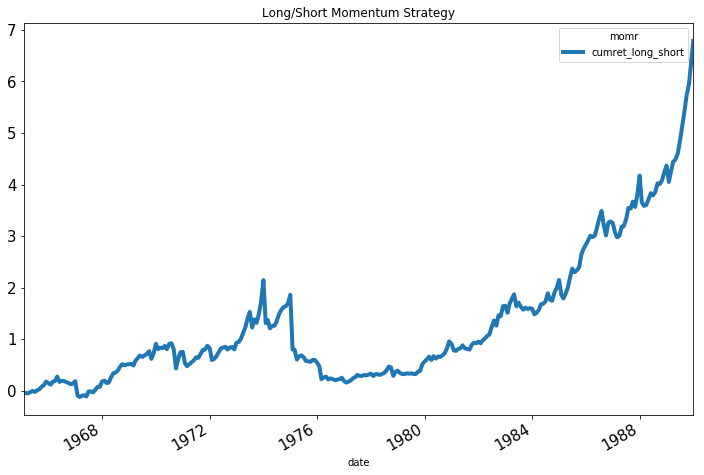
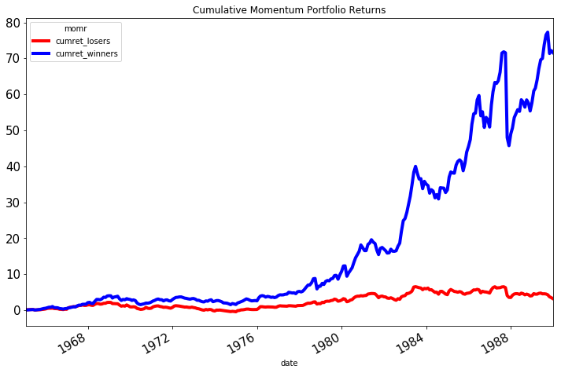

<dl class="meta-row">
<dt>Paper</dt><dd><a href="https://www.jstor.org/stable/2328882">Jegadeesh, N. and S. Titman (1993), Returns to Buying Winners and Selling Losers, <em>Journal of Finance</em></a></dd>
<dt>Data</dt><dd>CRSP monthly stock file <span class="tag">legacy SIZ</span> <span class="tag ciz">CIZ version pending</span></dd>
<dt>Author</dt><dd>Qingyi (Freda) Song Drechsler · June 2019, updated June 2020</dd>
</dl>

<div class="btn-row">
<a class="primary" href="https://drive.google.com/file/d/10yBYSRWrSvkABKiabauF6pGtGhKH0tUe/view?usp=sharing">Full Code</a>
</div>

This code replicates the methodology of Jegadeesh and Titman (1993). Momentum portfolios are formed based on past 3-12 months returns. This is a relatively simple Python application as it involves only one database, which is CRSP, and main variable of interest, cumulative past return, is fairly easy to compute.

## Setup

As always, first import the various Python data packages and establish connection with WRDS server.

```python
################################################
# Jegadeesh & Titman (1993) Momentum Portfolio #
# Qingyi (Freda) Song Drechsler                #
# Date: June 2019                              #  
# Updated: June 2020                           #  
################################################

import pandas as pd
import numpy as np
import wrds
import matplotlib.pyplot as plt
from pandas.tseries.offsets import *
from scipy import stats

###################
# Connect to WRDS #
###################
conn=wrds.Connection()
```

## CRSP data

The next step is to extract return related data from CRSP database:

```python
###################
# CRSP Block      #
###################
# sql similar to crspmerge macro
# added exchcd=-2,-1,0 to address the issue that stocks temp stopped trading
# without exchcd=-2,-1, 0 the non-trading months will be tossed out in the output
# leading to wrong cumret calculation in momentum step
# Code	Definition
# -2	Halted by the NYSE or AMEX
# -1	Suspended by the NYSE, AMEX, or NASDAQ
# 0	Not Trading on NYSE, AMEX, or NASDAQ
# 1	New York Stock Exchange
# 2	American Stock Exchange

crsp_m = conn.raw_sql("""
                      select a.permno, a.permco, b.ncusip, a.date, 
                      b.shrcd, b.exchcd, b.siccd,
                      a.ret, a.vol, a.shrout, a.prc, a.cfacpr, a.cfacshr
                      from crsp.msf as a
                      left join crsp.msenames as b
                      on a.permno=b.permno
                      and b.namedt<=a.date
                      and a.date<=b.nameendt
                      where a.date between '01/01/1963' and '12/31/1989'
                      and b.exchcd between -2 and 2
                      and b.shrcd between 10 and 11
                      """) 

# Change variable format to int
crsp_m[['permco','permno','shrcd','exchcd']]=\
    crsp_m[['permco','permno','shrcd','exchcd']].astype(int)

# Line up date to be end of month
crsp_m['date']=pd.to_datetime(crsp_m['date'])
```

## Cumulative past returns

With the return data ready, I then calculate the cumulative return by summing log returns. There can be many other methods to arrive at the same goal.

```python
#######################################################
# Create Momentum Portfolio                           #   
# Measures Based on Past (J) Month Compounded Returns #
#######################################################

J = 6 # Formation Period Length: J can be between 3 to 12 months
K = 6 # Holding Period Length: K can be between 3 to 12 months

_tmp_crsp = crsp_m[['permno','date','ret']].sort_values(['permno','date'])\
    .set_index('date')

# Replace missing return with 0
_tmp_crsp['ret']=_tmp_crsp['ret'].fillna(0)

# Calculate rolling cumulative return
# by summing log(1+ret) over the formation period
_tmp_crsp['logret']=np.log(1+_tmp_crsp['ret'])
umd = _tmp_crsp.groupby(['permno'])['logret'].rolling(J, min_periods=J).sum()
umd = umd.reset_index()
umd['cumret']=np.exp(umd['logret'])-1
```

## Portfolio formation

Form momentum portfolios:

```python
########################################
# Formation of 10 Momentum Portfolios  #
########################################

# For each date: assign ranking 1-10 based on cumret
# 1=lowest 10=highest cumret
umd=umd.dropna(axis=0, subset=['cumret'])
umd['momr']=umd.groupby('date')['cumret'].transform(lambda x: pd.qcut(x, 10, labels=False))

umd.momr=umd.momr.astype(int)
umd['momr'] = umd['momr']+1

# Corrected previous version month end line up issue
# First lineup date to month end date medate
# Then calculate hdate1 and hdate2 using medate

umd['form_date'] = umd['date']
umd['medate'] = umd['date']+MonthEnd(0)
umd['hdate1']=umd['medate']+MonthBegin(1)
umd['hdate2']=umd['medate']+MonthEnd(K)
umd = umd[['permno', 'form_date','momr','hdate1','hdate2']]

# join rank and return data together
# note: this step consumes a lot of memory so takes a while
_tmp_ret = crsp_m[['permno','date','ret']]
port = pd.merge(_tmp_ret, umd, on=['permno'], how='inner')
port = port[(port['hdate1']<=port['date']) & (port['date']<=port['hdate2'])]

umd2 = port.sort_values(by=['date','momr','form_date','permno']).drop_duplicates()
umd3 = umd2.groupby(['date','momr','form_date'])['ret'].mean().reset_index()

# Skip first two years of the sample 
start_yr = umd3['date'].dt.year.min()+2
umd3 = umd3[umd3['date'].dt.year>=start_yr]
umd3 = umd3.sort_values(by=['date','momr'])

# Create one return series per MOM group every month
ewret = umd3.groupby(['date','momr'])['ret'].mean().reset_index()
ewstd = umd3.groupby(['date','momr'])['ret'].std().reset_index()
ewret = ewret.rename(columns={'ret':'ewret'})
ewstd = ewstd.rename(columns={'ret':'ewretstd'})
ewretdat = pd.merge(ewret, ewstd, on=['date','momr'], how='inner')
ewretdat = ewretdat.sort_values(by=['momr'])

# portfolio summary
ewretdat.groupby(['momr'])['ewret'].describe()[['count','mean', 'std']]
```

## Long–short portfolio

Calculate long winners-short losers strategy and report portfolio statistics:

```python
#################################
# Long-Short Portfolio Returns  #
#################################

# Transpose portfolio layout to have columns as portfolio returns
ewretdat2 = ewretdat.pivot(index='date', columns='momr', values='ewret')

# Add prefix port in front of each column
ewretdat2 = ewretdat2.add_prefix('port')
ewretdat2 = ewretdat2.rename(columns={'port1':'losers', 'port10':'winners'})
ewretdat2['long_short'] = ewretdat2['winners'] - ewretdat2['losers']

# Compute Long-Short Portfolio Cumulative Returns
ewretdat3 = ewretdat2
ewretdat3['1+losers']=1+ewretdat3['losers']
ewretdat3['1+winners']=1+ewretdat3['winners']
ewretdat3['1+ls'] = 1+ewretdat3['long_short']

ewretdat3['cumret_winners']=ewretdat3['1+winners'].cumprod()-1
ewretdat3['cumret_losers']=ewretdat3['1+losers'].cumprod()-1
ewretdat3['cumret_long_short']=ewretdat3['1+ls'].cumprod()-1

#################################
# Portfolio Summary Statistics  #
################################# 

# Mean 
mom_mean = ewretdat3[['winners', 'losers', 'long_short']].mean().to_frame()
mom_mean = mom_mean.rename(columns={0:'mean'}).reset_index()

# T-Value and P-Value
t_losers = pd.Series(stats.ttest_1samp(ewretdat3['losers'],0.0)).to_frame().T
t_winners = pd.Series(stats.ttest_1samp(ewretdat3['winners'],0.0)).to_frame().T
t_long_short = pd.Series(stats.ttest_1samp(ewretdat3['long_short'],0.0)).to_frame().T

t_losers['momr']='losers'
t_winners['momr']='winners'
t_long_short['momr']='long_short'

t_output =pd.concat([t_winners, t_losers, t_long_short])\
    .rename(columns={0:'t-stat', 1:'p-value'})

# Combine mean, t and p
mom_output = pd.merge(mom_mean, t_output, on=['momr'], how='inner')
```

## Results

The table below reports the summary statistics of the winner, loser and long-short portfolios.

The chart below reports the historical performance of the momentum strategy:

The left figure reports the cumulative return of the long-short portfolio. The right figure reports the winner and loser portfolio separately, where the blue line represents the portfolio return of the past winners and the red line shows the portfolio return for past losers.

::: {layout-ncol=2}



:::
