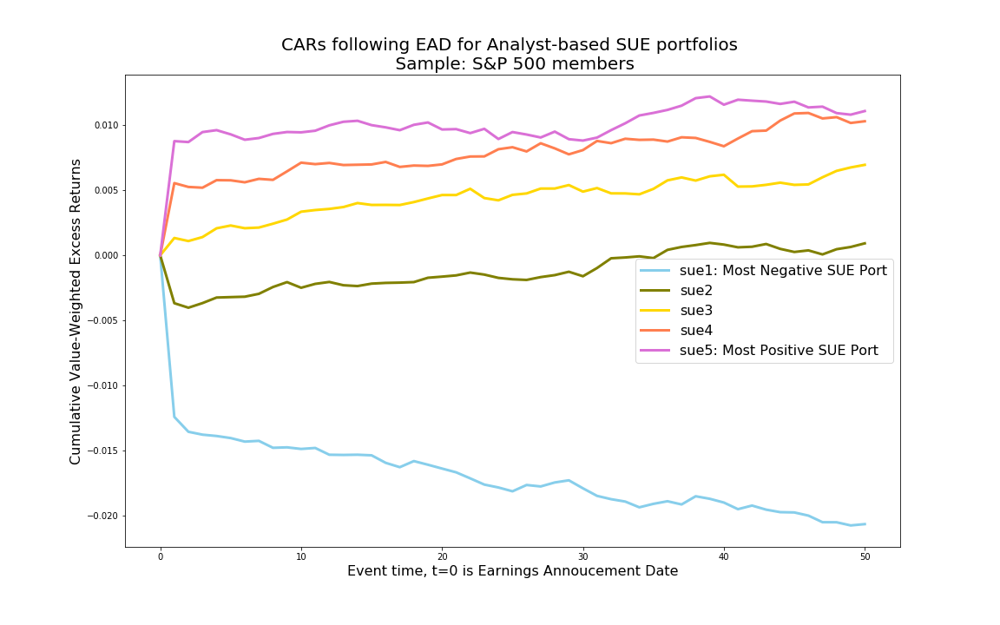

This program is designed to calculate earnings surprises (SUE) and form portfolios based on SUE. These portfolios continue to display return drifts after the earnings announcement dates, and hence are referred to as post-earnings announcement drift (PEAD) portfolios. The logic of the program is based on the paper by [Livnat and Mendenhall (2006)](https://onlinelibrary.wiley.com/doi/abs/10.1111/j.1475-679X.2006.00196.x). The sample universe of this code is set to be S&P 500 index constituents.

<div class="btn-row"><a class="primary" href="https://drive.google.com/file/d/11DnXsnzznWB5Yzgu-h1IUnBH-lgxvB5D/view?usp=sharing">Full Code</a></div>

**Notes before attempting the code**

This code relies on a linking table before IBES and CRSP (ICLINK), which is invoked in Step 0. The static table "iclink.pkl" was the output of a separate python program ICLINK. Please make sure to run the[ICLINK python code](iclink.ipynb) before running this PEAD code.

Unlike SAS, Python is not known for handling large dataset efficiently in memory. As a result of this constraint, one might not be able to run the entire sample period (1980-now) in python one shot. Instead, you can break up the sample period into batches by changing start and end date (begdate and enddate) of the program, before finally piecing the outputs together.

We start by importing proper packages and setting macro variables for the sample date. Notice the two sets of date variables: CRSP related date ranges are set to be a bit longer than the IBES date range to make sure earlier sample months have valid records.

```python
#####################################
# Post Earnings Announcement Drift  #
# Qingyi (Freda) Song Drechsler     #
# Date: June 2019                   #
# Update: Jan 2021                  #
#####################################

# Update Note: this version uses CRSP data to extract S&P500 Index constituents,
# as comp.idxcst_hist data is no longer available on WRDS
# Also updated various .loc usage that has been deprecated by Python.

import pandas as pd
import numpy as np
import wrds
import matplotlib.pyplot as plt
import pickle as pkl
from dateutil.relativedelta import *
import datetime

###################
# Connect to WRDS #
###################
conn=wrds.Connection()

# set sample date range
begdate = '01/01/2010'
enddate = '12/31/2018'

# set CRSP date range a bit wider to guarantee collecting all information
crsp_begdate = '01/01/2009'
crsp_enddate = '12/31/2019'
```

Then we load the linking table between IBES and CRSP, stored from the ICLINK python code.

```python
#################################
# Step 0: Read in ICLINK output #
#################################

# iclink.pkl is the output from the python program iclink
# it contains the linking between crsp and ibes
with open('iclink.pkl', 'rb') as f:
    iclink = pkl.load(f)
```

Step 1 below extracts index constituents information from Compustat, linking table between CRSP and Compustat, and security identifier information from IBES.

In the original SAS datasets, if a company's link is still effective, the variable link end date (linkenddt) will be marked as '.E', which in postgres table is converted into missing. To reverse this, I use today's date to fill in the missing linkenddt.

```python
##################################
# Step 1. S&P 500 Index Universe #
##################################

# All companies that were ever included in S&P 500 index as an example
# Old version of the code uses comp.idxcst_his

# New code uses crsp.msp500list
# Linking Compustat GVKEY and IBES Tickers using ICLINK               
# For unmatched GVKEYs, use header IBTIC link in Compustat Security file 


sp500 = conn.raw_sql(f"""
                        select a.*
                        from crsp.msp500list as a;
                        """, date_cols=['start', 'ending'])

# CCM data
_ccm = conn.raw_sql(""" select gvkey, lpermco as permco, lpermno as permno, 
                        linkdt, linkenddt 
                        from crsp.ccmxpf_linktable 
                        where usedflag=1 
                        and linkprim in ('P', 'C')""", date_cols=['linkdt', 'linkenddt'])

_ccm[['permco', 'permno']] = _ccm[['permco', 'permno']].astype(int)

# Fill linkenddt missing value (.E in SAS dataset) with today's date
_ccm['linkenddt'] = _ccm.linkenddt.fillna(datetime.date.today())

_sec = conn.raw_sql(""" select ibtic, gvkey from comp.security """)


# Start the sequence of left join
gvkey = pd.merge(sp500, _ccm, how='left', on=['permno'])
gvkey = pd.merge(gvkey, _sec.loc[_sec.ibtic.notna()], how='left', on=['gvkey'])

# high quality links from iclink
# score = 0 or 1
iclink_hq = iclink.loc[(iclink.score <=1)]

gvkey = pd.merge(gvkey, iclink_hq, how='left', on=['permno'])

# fill missing ticker with ibtic
gvkey.ticker = np.where(gvkey.ticker.notnull(), gvkey.ticker, gvkey.ibtic)

# Keep relevant columns and drop duplicates if there is any
gvkey = gvkey[['gvkey', 'permco', 'permno', 'linkdt', 'linkenddt','ticker']]

gvkey = gvkey.drop_duplicates()

# date ranges from gvkey
# min linkdt for ticker and permno combination
gvkey_mindt = gvkey.groupby(['ticker','permno']).linkdt.min().reset_index()

# max linkenddt for ticker and permno combination
gvkey_maxdt = gvkey.groupby(['ticker','permno']).linkenddt.max().reset_index()

# link date range 
gvkey_dt = pd.merge(gvkey_mindt, gvkey_maxdt, how='inner', on=['ticker','permno'])
```

The block of code below extracts estimate related information from IBES.

```python
#######################################
# Step 2. Extract Estimates from IBES #
#######################################

# Extract estimates from IBES Unadjusted file and select    
# the latest estimate for a firm within broker-analyst group
# "fpi in (6,7)" selects quarterly forecast for the current 
# and the next fiscal quarter    

ibes_temp = conn.raw_sql(f"""
                        select ticker, estimator, analys, pdf, fpi, value, 
                        fpedats, revdats, revtims, anndats, anntims
                        from ibes.detu_epsus 
                        where fpedats between '{begdate}' and '{enddate}'
                        and (fpi='6' or fpi='7')
                        """, date_cols = ['revdats', 'anndats', 'fpedats'])


# merge to get date range linkdt and linkenddt to fulfill date requirement
ibes_temp = pd.merge(ibes_temp, gvkey_dt, how='left', on=['ticker'])
ibes_temp = ibes_temp.loc[(ibes_temp.linkdt<=ibes_temp.anndats) & (ibes_temp.anndats <= ibes_temp.linkenddt)]
```

As forecasts can be made based on either primary (P) or diluted (D) basis, the next step is to assign a dominant reporting basis for each security.

```python
# Count number of estimates reported on primary/diluted basis 

p_sub = ibes_temp[['ticker','fpedats','pdf']].loc[ibes_temp.pdf=='P']
d_sub = ibes_temp[['ticker','fpedats','pdf']].loc[ibes_temp.pdf=='D']

p_count = p_sub.groupby(['ticker','fpedats']).pdf.count().reset_index().rename(columns={'pdf':'p_count'})
d_count = d_sub.groupby(['ticker','fpedats']).pdf.count().reset_index().rename(columns={'pdf':'d_count'})

ibes = pd.merge(ibes_temp, d_count, how = 'left', on=['ticker', 'fpedats'])
ibes = pd.merge(ibes, p_count, how='left', on =['ticker','fpedats'])
ibes['d_count'] = ibes.d_count.fillna(0)
ibes['p_count'] = ibes.p_count.fillna(0)

# Determine whether most analysts report estimates on primary/diluted basis
# following Livnat and Mendenhall (2006)                                   

ibes['basis']=np.where(ibes.p_count>ibes.d_count, 'P', 'D')

ibes = ibes.sort_values(by=['ticker','fpedats','estimator','analys','anndats', 'anntims', 'revdats', 'revtims'])\
.drop(['linkdt', 'linkenddt','p_count','d_count', 'pdf', 'fpi'], axis=1)

# Keep the latest observation for a given analyst
# Group by company fpedats estimator analys then pick the last record in the group

ibes_1 = ibes.groupby(['ticker','fpedats','estimator','analys']).apply(lambda x: x.index[-1]).to_frame().reset_index()

# reset index to the old dataframe index for join in the next step
ibes_1=ibes_1.set_index(0)

# Inner join with the last analyst record per group
ibes = pd.merge(ibes, ibes_1[['analys']], left_index=True, right_index=True)

# drop duplicate column
ibes=ibes.drop(['analys_y'], axis=1).rename(columns={'analys_x': 'analys'})
```

Step 3 handles the linkage between the analysts' forecasts and the actual earnings.

```python
#######################################
# Step 3. Link Estimates with Actuals #
#######################################

# Link Unadjusted estimates with Unadjusted actuals and CRSP permnos  
# Keep only the estimates issued within 90 days before the report date

# Getting actual piece of data
ibes_act = conn.raw_sql(f"""
                        select ticker, anndats as repdats, value as act, pends as fpedats, pdicity
                        from ibes.actu_epsus 
                        where pends between '{begdate}' and '{enddate}'
                        and pdicity='QTR'
                        """, date_cols = ['repdats', 'fpedats'])


# Join with the estimate piece of the data

ibes1 = pd.merge(ibes, ibes_act, how='left', on = ['ticker','fpedats'])
ibes1['dgap'] = ibes1.repdats - ibes1.anndats

ibes1['flag'] = np.where( (ibes1.dgap>=datetime.timedelta(days=0)) & (ibes1.dgap<=datetime.timedelta(days=90)) & (ibes1.repdats.notna()) & (ibes1.anndats.notna()), 1, 0)

ibes1 = ibes1.loc[ibes1.flag==1].drop(['flag', 'dgap', 'pdicity'], axis=1)

# Select all relevant combinations of Permnos and Date

ibes1_dt1 = ibes1[['permno', 'anndats']].drop_duplicates()

ibes1_dt2 = ibes1[['permno', 'repdats']].drop_duplicates().rename(columns={'repdats':'anndats'})

ibes_anndats = pd.concat([ibes1_dt1, ibes1_dt2]).drop_duplicates()
```

The section of code below adjusts all estimate and earnings announcement dates to the closest preceding trading date in CRSP to ensure that adjustment factors won't be missing after the merge.

```python
# Adjust all estimate and earnings announcement dates to the closest
# preceding trading date in CRSP to ensure that adjustment factors won't
# be missing after the merge  

# unique anndats from ibes
uniq_anndats = ibes_anndats[['anndats']].drop_duplicates()

# unique trade dates from crsp.dsi
crsp_dats = conn.raw_sql(""" 
                            select date 
                            from crsp.dsi 
                         """, date_cols=['date'])

# Create up to 5 days prior dates relative to anndats

for i in range(0, 5):
    uniq_anndats[i] = uniq_anndats.anndats - datetime.timedelta(days=i)

# reshape (transpose) the df for later join with crsp trading dates

expand_anndats = uniq_anndats.set_index('anndats').stack().reset_index().\
rename(columns={'level_1':'prior', 0:'prior_date'})

# merge with crsp trading dates
tradedates = pd.merge(expand_anndats, crsp_dats, how='left', left_on=['prior_date'], right_on=['date'])

# create the dgap (days gap) variable for min selection
tradedates['dgap'] = tradedates.anndats-tradedates.date

# choosing the row with the smallest dgap for a given anndats
tradedates = tradedates.loc[tradedates.groupby('anndats')['dgap'].idxmin()]

tradedates = tradedates[['anndats', 'date']]
```

We then merge the CRSP adjustment factors for all estimate and report dates:

```python
# merge the CRSP adjustment factors for all estimate and report dates

# extract CRSP adjustment factors
cfacshr = conn.raw_sql(f"""
                        select permno, date, cfacshr
                        from crsp.dsf
                        where date between '{crsp_begdate}' and '{crsp_enddate}'
                        """, date_cols = ['date'])

ibes_anndats = pd.merge(ibes_anndats, tradedates, how='left', on = ['anndats'])

ibes_anndats = pd.merge(ibes_anndats, cfacshr, how='left', on=['permno', 'date'])
```

One caveat in dealing with the comparison between forecasts and actuals is that companies may experience corporate actions during the time period in between, and hence comparing the raw figures can lead to artificial surprises! Therefore, we first need to adjust the estimates using adjustment factors from CRSP, to make sure they are based on the same underlying shares as the actuals.

```python
#########################################
# Step 4. Adjust Estimates with CFACSHR #
#########################################

# Put the estimate on the same per share basis as
# company reported EPS using CRSP Adjustment factors. 
# New_value is the estimate adjusted to be on the 
# same basis with reported earnings.

ibes1 = pd.merge(ibes1, ibes_anndats, how='inner', on=['permno', 'anndats'])
ibes1 = ibes1.drop(['anndats','date'], axis=1).rename(columns={'cfacshr':'cfacshr_ann'})

ibes1 = pd.merge(ibes1, ibes_anndats, how='inner', left_on=['permno', 'repdats'], right_on=['permno','anndats'])
ibes1 = ibes1.drop(['anndats','date'], axis=1).rename(columns={'cfacshr':'cfacshr_rep'})

ibes1['new_value'] = (ibes1.cfacshr_rep/ibes1.cfacshr_ann)*ibes1.value

# Sanity check: there should be one most recent estimate for 
# a given firm-fiscal period end combination 
ibes1 = ibes1.sort_values(by=['ticker','fpedats','estimator','analys']).drop_duplicates()
```

Now the "new_value" variable reflects the adjusted estimates by analysts. The median estimates is calculated below.

```python
# Compute the median forecast based on estimates in the 90 days prior to the EAD

grp_permno = ibes1.groupby(['ticker','fpedats', 'basis','repdats', 'act']).permno.max().reset_index()

medest = ibes1.groupby(['ticker','fpedats', 'basis','repdats', 'act']).new_value.agg(['median','count']).reset_index()
medest = pd.merge(medest, grp_permno, how='inner', on=['ticker','fpedats','basis', 'repdats', 'act'])
medest = medest.rename(columns={'median': 'medest', 'count':'numest'})
```

Extract fundamental data from Compustat.

```python
######################################
# Step 5. Merge with Compustat Data  #
######################################

# get items from fundq
fundq = conn.raw_sql(f"""
                        select gvkey, fyearq, fqtr, conm, datadate, rdq, epsfxq, epspxq, cshoq, prccq, 
                        ajexq, spiq, cshoq, cshprq, cshfdq, saleq, atq, fyr, datafqtr, cshoq*prccq as mcap  
                        from comp.fundq 
                        where consol='C' and popsrc='D' and indfmt='INDL' and datafmt='STD'
                        and datadate between '{crsp_begdate}' and '{crsp_enddate}' 
                        """, date_cols = ['datadate', 'datafqtr', 'rdq'])

fundq = fundq.loc[((fundq.atq>0) | (fundq.saleq.notna())) & (fundq.datafqtr.notna())]


# Calculate link date ranges for givken gvkey and ticker combination

gvkey_mindt1 = gvkey.groupby(['gvkey', 'ticker']).linkdt.min().reset_index().rename(columns={'linkdt':'mindate'})
gvkey_maxdt1 = gvkey.groupby(['gvkey', 'ticker']).linkenddt.max().reset_index().rename(columns={'linkenddt':'maxdate'})
gvkey_dt1 = pd.merge(gvkey_mindt1, gvkey_maxdt1, how='inner', on=['gvkey','ticker'])


# Use the date range to merge
comp = pd.merge(fundq, gvkey_dt1, how='left', on =['gvkey'])
comp = comp.loc[(comp.ticker.notna()) & (comp.datadate<=comp.maxdate) & (comp.datadate>=comp.mindate)]

# Merge with the median esitmates
comp = pd.merge(comp, medest, how = 'left', left_on=['ticker','datadate'], right_on=['ticker', 'fpedats'])

# Sort data and drop duplicates
comp = comp.sort_values(by=['gvkey','fqtr','fyearq']).drop_duplicates()
```

```python
###########################
# Step 6. Calculate SUEs  #
###########################

# block handling lag eps

sue = comp.sort_values(by=['gvkey','fqtr','fyearq'])

sue['dif_fyearq'] = sue.groupby(['gvkey', 'fqtr']).fyearq.diff()
sue['laggvkey']   = sue.gvkey.shift(1)

# handling same qtr previous year

cond_year = sue.dif_fyearq==1 # year increment is 1

sue['lagadj']     = np.where(cond_year, sue.ajexq.shift(1), None)
sue['lageps_p']   = np.where(cond_year, sue.epspxq.shift(1), None)
sue['lageps_d']   = np.where(cond_year, sue.epsfxq.shift(1), None)
sue['lagshr_p']   = np.where(cond_year, sue.cshprq.shift(1), None)
sue['lagshr_d']   = np.where(cond_year, sue.cshfdq.shift(1), None)
sue['lagspiq']    = np.where(cond_year, sue.spiq.shift(1), None)

# handling first gvkey

cond_gvkey = sue.gvkey != sue.laggvkey # first.gvkey

sue['lagadj']     = np.where(cond_gvkey, None, sue.lagadj)
sue['lageps_p']   = np.where(cond_gvkey, None, sue.lageps_p)
sue['lageps_d']   = np.where(cond_gvkey, None, sue.lageps_d)
sue['lagshr_p']   = np.where(cond_gvkey, None, sue.lagshr_p)
sue['lagshr_d']   = np.where(cond_gvkey, None, sue.lagshr_d)
sue['lagspiq']    = np.where(cond_gvkey, None, sue.lagspiq)


# handling reporting basis 

# Basis = P and missing are treated the same

sue['actual1'] = np.where(sue.basis=='D', sue.epsfxq/sue.ajexq, sue.epspxq/sue.ajexq)

sue['actual2'] = np.where(sue.basis=='D', \
                            (sue.epsfxq.fillna(0)-(0.65*sue.spiq/sue.cshfdq).fillna(0))/sue.ajexq, \
                            (sue.epspxq.fillna(0)-(0.65*sue.spiq/sue.cshprq).fillna(0))/sue.ajexq
                           )

sue['expected1'] = np.where(sue.basis=='D', sue.lageps_d/sue.lagadj, sue.lageps_p/sue.lagadj)
sue['expected2'] = np.where(sue.basis=='D', \
                              (sue.lageps_d.fillna(0)-(0.65*sue.lagspiq/sue.lagshr_d).fillna(0))/sue.lagadj, \
                              (sue.lageps_p.fillna(0)-(0.65*sue.lagspiq/sue.lagshr_p).fillna(0))/sue.lagadj
                             )

# SUE calculations
sue['sue1'] = (sue.actual1 - sue.expected1) / (sue.prccq/sue.ajexq)
sue['sue2'] = (sue.actual2 - sue.expected2) / (sue.prccq/sue.ajexq)
sue['sue3'] = (sue.act - sue.medest) / sue.prccq

sue = sue[['ticker','permno','gvkey','conm','fyearq','fqtr','fyr','datadate','repdats','rdq', \
           'sue1','sue2','sue3','basis','act','medest','numest','prccq','mcap']]

# Shifting the announcement date to be the next trading day
# Defining the day after the following quarterly EA as leadrdq1

# unique rdq 
uniq_rdq = comp[['rdq']].drop_duplicates()

# Create up to 5 days post rdq relative to rdq
for i in range(0, 5):
    uniq_rdq[i] = uniq_rdq.rdq + datetime.timedelta(days=i)

# reshape (transpose) for later join with crsp trading dates
expand_rdq = uniq_rdq.set_index('rdq').stack().reset_index().\
rename(columns={'level_1':'post', 0:'post_date'})

# merge with crsp trading dates
eads1 = pd.merge(expand_rdq, crsp_dats, how='left', left_on=['post_date'], right_on=['date'])

# create the dgap (days gap) variable for min selection
eads1['dgap'] = eads1.date-eads1.rdq

# LOC deprecated, use reindex instead
#eads1 = eads1.loc[eads1.groupby('rdq')['dgap'].idxmin()].rename(columns={'date':'rdq1'})
eads1 = eads1.reindex(eads1.groupby('rdq')['dgap'].idxmin()).rename(columns={'date':'rdq1'})

# create sue_final
sue_final = pd.merge(sue, eads1[['rdq','rdq1']], how='left', on=['rdq'])
sue_final = sue_final.sort_values(by=['gvkey', 'fyearq','fqtr'], ascending=[True, False, False]).drop_duplicates()
```

We now filter the sample based on the methodology described in Livnat & Mendenhall (2006):

- earnings announcement date is not missing in Compustat
- the price per share is missing from Compustat at fiscal quarter end
- price is greater than $1
- market cap is greater than $5 million
- with valid market and book value of equity at fiscal quarter end
- Earnings announcement dates obtained from Compustat and from IBES (if available) should not differ by more than one calendar day

```python
#  Filter from Livnat & Mendenhall (2006):                                
#- earnings announcement date is reported in Compustat                   
#- the price per share is available from Compustat at fiscal quarter end  
#- price is greater than $1                                              
#- the market (book) equity at fiscal quarter end is available and is    
# EADs in Compustat and in IBES (if available)should not differ by more  
# than one calendar day larger than $5 mil.                              

sue_final['leadrdq1'] = sue_final.rdq1.shift(1) # next consecutive EAD
sue_final['leadgvkey'] = sue_final.gvkey.shift(1)

# If first gvkey then leadrdq1 = rdq1+3 months
# Else leadrdq1 = previous rdq1

sue_final['leadrdq1'] = np.where(sue_final.gvkey == sue_final.leadgvkey, 
                                  sue_final.rdq1.shift(1), 
                                  sue_final.rdq1 + pd.offsets.MonthOffset(3))


#sue_final['dgap'] = (sue_final.repdats - sue_final.rdq).fillna(0)
sue_final['dgap'] = (sue_final.repdats - sue_final.rdq).fillna(pd.Timedelta(days=0))
sue_final = sue_final.loc[(sue_final.rdq1 != sue_final.leadrdq1)]

# Various conditioning for filtering
cond1 = (sue_final.sue1.notna()) & (sue_final.sue2.notna()) & (sue_final.repdats.isna())
cond2 = (sue_final.repdats.notna()) & (sue_final.dgap<=datetime.timedelta(days=1)) & (sue_final.dgap>=datetime.timedelta(days=-1))
sue_final = sue_final.loc[cond1 | cond2]

# Impose restriction on price and marketcap
sue_final = sue_final.loc[(sue_final.rdq.notna()) & (sue_final.prccq>1) & (sue_final.mcap>5)]

# Keep relevant columns
sue_final = sue_final[['gvkey', 'ticker','permno','conm', 'dgap',\
                       'fyearq','fqtr','datadate','fyr','rdq','rdq1','leadrdq1','repdats',\
                       'mcap','medest','act','numest','basis','sue1','sue2','sue3']]
```

Now that we have calculated the SUEs, the rest of the code sorts stocks into portfolios based on the SUEs, and analyzes the portfolio drifts post the formation date.

```python
#########################################
# Step 7. Form Portfolios Based on SUE  #
#########################################

# Extract file of raw daily returns around and between EADs and link them 
# to Standardized Earnings Surprises for forming SUE-based portfolios     

# Records from dsf and dsi to calculate exret
dsf = conn.raw_sql(f"""
                        select permno, date, prc, abs(prc*shrout) as mcap, ret from crsp.dsf
                        where date between '{crsp_begdate}' and '{crsp_enddate}'
                        """, date_cols = ['date'])

dsi = conn.raw_sql(f"""
                    select date, vwretd from crsp.dsi where date between '{crsp_begdate}' and '{crsp_enddate}'
                    """, date_cols=['date'])

ds = pd.merge(dsf, dsi, how='left', on=['date'])
ds['exret'] = ds.ret - ds.vwretd
ds = ds.rename(columns={'vwretd':'mkt'})

# Records from sue_final that meet the condition
sue_final_join = sue_final.loc[(sue_final.rdq.notna()) & (sue_final.leadrdq1.notna()) & (sue_final.permno.notna()) \
                               & (sue_final.leadrdq1-sue_final.rdq1>datetime.timedelta(days=30))]
sue_final_join1 = sue_final_join.copy()

sue_final_join1['lb_date'] = sue_final_join.rdq1-datetime.timedelta(days=5)
sue_final_join1['ub_date'] = sue_final_join.leadrdq1+datetime.timedelta(days=5)


sfj_indexed = sue_final_join1[['permno','rdq1', 'leadrdq1','sue1','sue2','sue3', 'lb_date','ub_date']].set_index('permno')
crsprets = ds.join(sfj_indexed, how='left', on='permno')
crsprets = crsprets.loc[(crsprets.date<=crsprets.ub_date) & (crsprets.date>=crsprets.lb_date)]
crsprets = crsprets.drop(['lb_date','ub_date'], axis=1)
```

To estimate the drift, sum daily returns over the period from 1 day after the earnings announcement through the day of the following quarterly earnings announcement.

```python
# To estimate the drift, sum daily returns over the period from  
# 1 day after the earnings announcement through the day of       
# the following quarterly earnings announcement       

temp = crsprets.sort_values(by=['permno', 'rdq1', 'date'])
temp['lpermno'] = temp.permno.shift(1)

# If first permno then lagmcap = missing 
# Else lagmcap = lag(mcap)
temp['lagmcap'] = np.where(temp.permno == temp.lpermno, 
                                  temp.mcap.shift(1), 
                                  None)

temp = temp.loc[(temp.rdq1<=temp.date) & (temp.date<=temp.leadrdq1)]

# create count variable within the group
temp['ncount'] = temp.groupby(['permno','rdq1']).cumcount()
```

In this part of the code, I use SUE3 as the main measure of earnings surprises and form portfolios based on it.

```python
# Form quintiles based on SUE
peadrets = temp.sort_values(by=['ncount','permno','rdq1']).drop_duplicates()

peadrets['sue1r']=peadrets.groupby('ncount')['sue1'].transform(lambda x: pd.qcut(x, 5, labels=False, duplicates='drop'))
peadrets['sue2r']=peadrets.groupby('ncount')['sue2'].transform(lambda x: pd.qcut(x, 5, labels=False, duplicates='drop'))
peadrets['sue3r']=peadrets.groupby('ncount')['sue3'].transform(lambda x: pd.qcut(x, 5, labels=False, duplicates='drop'))

# Form portfolios on Compustat-based SUEs (=sue1 or =sue2) or IBES-based SUE (=sue3)
# Code uses sue3

peadrets3 = peadrets.loc[peadrets.sue3r.notna()].sort_values(by=['ncount', 'sue3'])
peadrets3['sue3r'] = peadrets3['sue3r'].astype(int)

# Form value-weighted exret
# Calculate group weight sum;
grp_lagmcap = peadrets3.groupby(['ncount','sue3r']).lagmcap.sum().reset_index().rename(columns={'lagmcap':'total_lagmcap'})

# join group weight sum back to the df
peadrets3 = pd.merge(peadrets3, grp_lagmcap, how='left', on=['ncount','sue3r'])

# vw exret
peadrets3 = peadrets3.loc[peadrets3.total_lagmcap > 0]

peadrets3['wt_exret'] = peadrets3.exret * peadrets3.lagmcap / peadrets3.total_lagmcap
peadsue3port = peadrets3.groupby(['ncount', 'sue3r']).wt_exret.sum().reset_index()


# set ncount=0 all five portfolio weighted returns to be 0
peadsue3port['wt_exret'] = np.where(peadsue3port.ncount==0, 0, peadsue3port.wt_exret)

# transpose table for cumulative return calculation
peadsue3port = peadsue3port.pivot_table(index=['ncount'], columns='sue3r')

# reset column index level
peadsue3port.columns = [col[1] for col in peadsue3port.columns]
peadsue3port = peadsue3port.reset_index()

# keep only first 50 days after EADs
peadsue3port = peadsue3port.loc[peadsue3port.ncount<=50]

# Cumulating Excess Returns

peadsue3port['sueport1'] = peadsue3port[0].cumsum()
peadsue3port['sueport2'] = peadsue3port[1].cumsum()
peadsue3port['sueport3'] = peadsue3port[2].cumsum()
peadsue3port['sueport4'] = peadsue3port[3].cumsum()
peadsue3port['sueport5'] = peadsue3port[4].cumsum()
```

Last but not least, if you want to visualize the portfolio performance over time:

```python
# Plotting the output

import matplotlib.pyplot as plt
%matplotlib inline

plt.figure(figsize=(16,10))
plt.title('CARs following EAD for Analyst-based SUE portfolios \n Sample: S&P 500 members', fontsize=20)
plt.xlabel('Event time, t=0 is Earnings Annoucement Date', fontsize=16)
plt.ylabel('Cumulative Value-Weighted Excess Returns', fontsize=16)

plt.plot('ncount', 'sueport1', data=peadsue3port, color='skyblue', linewidth=3, label="sue1: Most Negative SUE Port")
plt.plot('ncount', 'sueport2', data=peadsue3port, color='olive', linewidth=3, label="sue2")
plt.plot('ncount', 'sueport3', data=peadsue3port, color='gold', linewidth=3, label="sue3")
plt.plot('ncount', 'sueport4', data=peadsue3port, color='coral', linewidth=3, label="sue4")
plt.plot('ncount', 'sueport5', data=peadsue3port, color='orchid', linewidth=3, label="sue5: Most Positive SUE Port")

plt.legend(loc="best", fontsize=16)

plt.savefig('./plot/pead_08_18.png')
```


