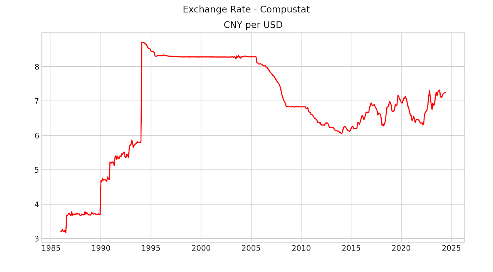
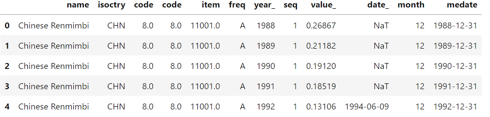
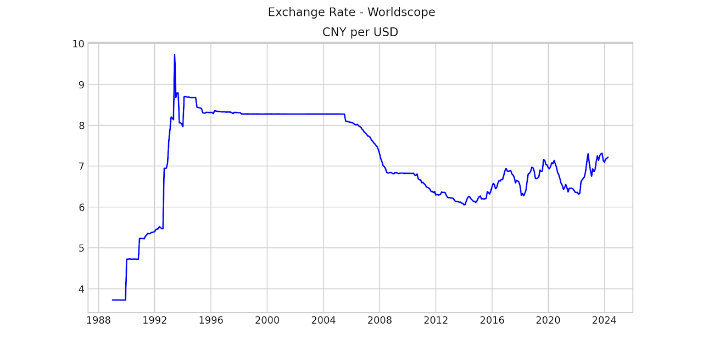
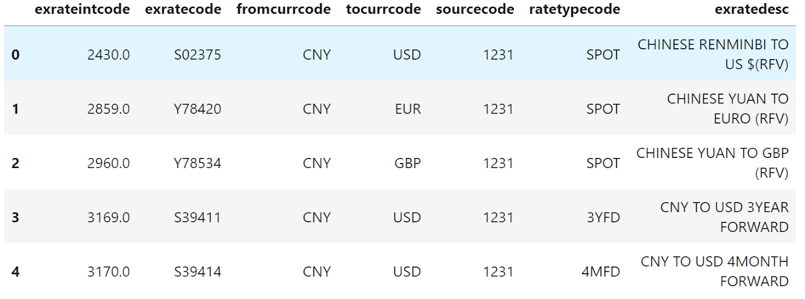
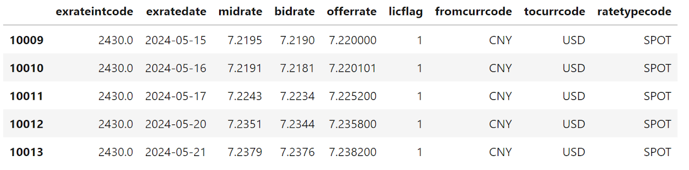
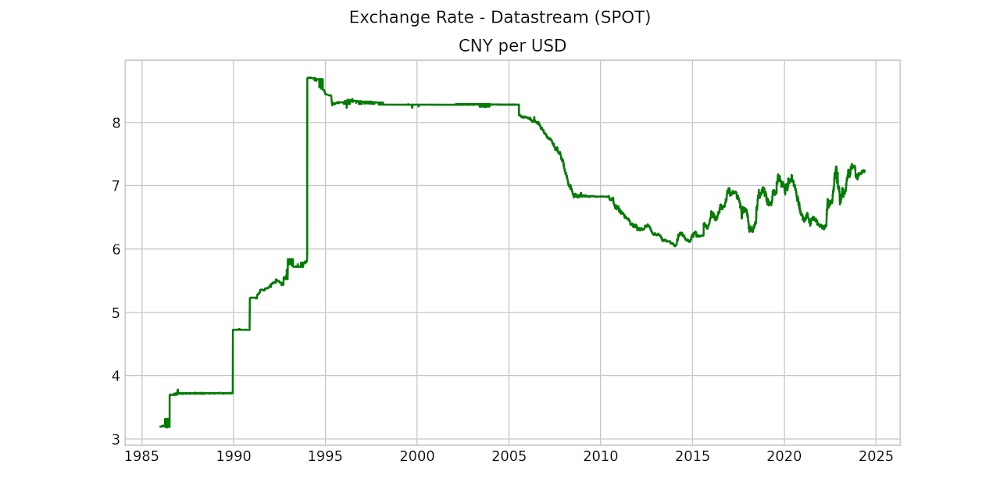

### Overview

Researchers working in the field of international finance often rely on WRDS platform to obtain empirical data for their research, whether it is fundamental data or pricing related data. Almost always these data items are reported in local currencies. For cross border comparison, researchers need to first convert all metrics from local currencies into a single currency, and that conversion naturally requires foreign currency exchange rate data.

There are several major databases on WRDS that carry international data, and each carries its native foreign currency exchange rate data piece. We will go over these data options one by one below by using the exchange rate between Chinese Yuan (CNY) and US Dollar (USD) as an example.

As always, users will need to first install WRDS Python API and establish connection using your WRDS credentials.

```python
import pandas as pd
import wrds

%matplotlib inline
import matplotlib.pyplot as plt

from datetime import datetime
###################
# Connect to WRDS #
###################
conn=wrds.Connection()
```

### Compustat Global

Compustat Global provides both fundamental and pricing data for all countries globally outside North America. The foreign currency exchange rate data comes in two frequencies:

- daily (compg.g_exrt_dly)
- monthly (compg.g_exrt_mth)

The exchange rate is always reported between a local currency (tocurd for daily or tocurm for monthly) to GBP (fromcurd and fromcurm for daily and monthly respectively).

In order to get exchange rate between a local currency (e.g. CNY) and another currency (e.g. USD), one can use two pairs of exchange rates (CNY vs GBP and USD vs GBP) and calculate the exchange between CNY and USD directly.

```python
# get CNY GBP rate
cnygbp = conn.raw_sql("""select tocurm,fromcurm,datadate,exratm 
                         from comp.g_exrt_mth where tocurm='CNY'""", 
                    date_cols=['datadate'])

# get USD GBP rate
usdgbp = conn.raw_sql("""select tocurm,fromcurm,datadate,exratm 
                         from comp.g_exrt_mth where tocurm='USD'""", 
                    date_cols=['datadate'])

# rename columns for later merging
cnygbp.rename(columns={'exratm':'cnygbp'}, inplace=True)
usdgbp.rename(columns={'exratm':'usdgbp'}, inplace=True)

# merge to create exchange rate between CNY and USD
cnyusd = pd.merge(cnygbp[['datadate','cnygbp']], usdgbp[['datadate','usdgbp']], how='inner', on = 'datadate')

# create USD CNY rate
cnyusd['cnyusd'] = cnyusd.cnygbp / cnyusd.usdgbp
```

The last step gives us the direct exchange rate between CNY and USD. The chart below shows the historical exchange rate obtained using Compustat Global data.



### Worldscope

Worldscope data carries exchange rate meta information and the actual exchange rate data in two separate tables.

- tr_worldscope.wsinfo - meta information on the currency name, country, code variables and more
- tr_worldscope.wsndata - where actual numeric data is stored

Users will need to rely on the code variable looked up in the wsinfo table to extract the desired exchange rate data (or any other numeric data for that matter) from the wsndata table.

```python
# code variable is used to link across different WS datasets

wsExRate = conn.raw_sql("""select b.name, b.isoctry, b.code, a.*
                            from tr_worldscope.wsndata as a 
                            inner join 
                            tr_worldscope.wsinfo as b
                            on a.code = b.code
                            and b.entity='E' and b.isoctry='CHN'""",
                       date_cols=['date_'])
```



One may notice from the output table that the exchange rate information seemingly comes only at annual frequency, where year_ variable indicates the year information, and value_ variable indicates the actual exchange rate. How would one then obtain monthly exchange rate data when only annual rate is available? It turns out that Worldscope uses the item variable here to indicate month end information.

More specifically,

- 11013 To U.S. Dollars - Current 
- 11002 To U.S. Dollars - January Month End 
- 11003 To U.S. Dollars - February Month End 
- 11004 To U.S. Dollars - March Month End 
- 11005 To U.S. Dollars - April Month End 
- 11006 To U.S. Dollars - May Month End 
- 11007 To U.S. Dollars - June Month End 
- 11008 To U.S. Dollars - July Month End 
- 11009 To U.S. Dollars - August Month End 
- 11010 To U.S. Dollars - September Month End 
- 11011 To U.S. Dollars - October Month End 
- 11012 To U.S. Dollars - November Month End 
- 11001 To U.S. Dollars - December Month End

Therefore, users can create a monthly time series of exchange rate using the month end info from "item" variable + "year_" variable.

```python
# remove the "Current" version of exchange rate item == 11013
wsExRate = wsExRate[wsExRate.item != 11013]

# imply month info from item variable
wsExRate['month']=wsExRate.apply(lambda x: int(x['item']-11001) if x['item'] != 11001 else 12, axis=1)

# create monthly variable using item and year_
wsExRate['medate']=wsExRate.apply(lambda x: datetime(x.year_, x.month, 1), axis=1)

# align to month end
wsExRate['medate'] = wsExRate['medate']+pd.offsets.MonthEnd(0)

# sort data according to time
wsExRate.sort_values(by=['medate'], inplace=True)

# create local currency per USD for comparison against Compustat Global output
wsExRate['localPerUSD'] = wsExRate.apply(lambda x: 1/x.value_, axis=1)
```

As Worldscope reports the exchange rate value_ as USD per local currency, I created an inverse version of this variable localPerUSD in order to compare with that from other databases. The chart below plots the time series of this value.



### Datastream

The last exchange rate data source is Datastream. Datastream on WRDS platform comes in four different packages: commodities, economics, equities and futures. Slightly counter intuitive, the exchange rate data is actually part of the equities data package.

And similar to the Worldscope data structure, meta data and actual time series data reside in two separate tables:

- tr_ds_equities.ds2fxcode - meta table for looking up exchange rate code and description
- tr_ds_equities.ds2fxrate - time series exchange rate data

For instance, the code below extracts all meta information for records with fromcurrcode = "CNY":

```python
# All Chinese Yuan related exchange rates
dsfxcode = conn.raw_sql("""select * from tr_ds_equities.ds2fxcode 
                            where fromcurrcode ='CNY'""")
```

The first few records from the output table contain two key observations.



- Unlike Compustat Global and Worldscope where a single core currency is relied upon as intermediate for exchange rate calculation (GBP and USD respectively), Datastream reports more than one currency in the tocurrcode variable. In the case of CNY, 8 different currencies are reported in this table under the tocurrcode category: ['USD' 'EUR' 'GBP' 'RON' 'SAR' 'BRL' 'SGD' 'CHF'].
- For a given pair of from and to currencies, SPOT as well as many variations of forward prices are available. For the case of CNY/USD, there are 45 different ratetypecode reported in the ds2fxcode table, such as "CNY to USD 3YEAR FORWARD", "CNY TO USD 1WEEK FORWARD", etc.

So for the SPOT rate, one should simply focus on the records where ratetypecode equals to SPOT:

```python
# extract SPOT rate of CNY vs USD
dsCNYUSD = conn.raw_sql(""" select a.*, b.fromcurrcode, b.tocurrcode, b.ratetypecode
                            from tr_ds_equities.ds2fxrate as a 
                            inner join 
                            tr_ds_equities.ds2fxcode as b
                            on a.exrateintcode = b.exrateintcode
                            and b.fromcurrcode = 'CNY' 
                            and b.tocurrcode = 'USD'
                            and b.ratetypecode = 'SPOT'""", 
                       date_cols=['exratedate'])

# sort by time
dsCNYUSD.sort_values(by=['exratedate'], inplace=True)
```

The latest records from Datastream on CNY and USD exchange SPOT rate is reported in the table below. Notice that in addition to midrate, Datastream also reports bidrate and offerrate as well.




