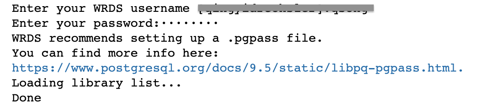
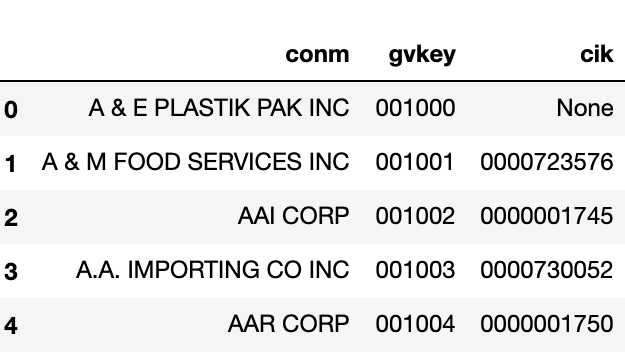
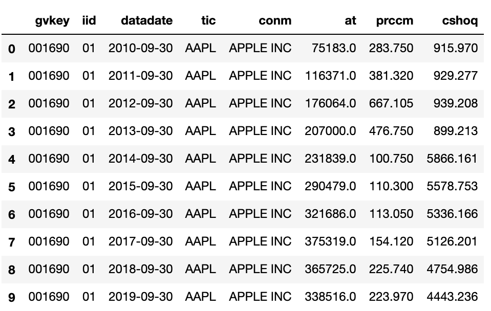

### 0. Setup WRDS Python API

Did you know that there's a [WRDS python API](https://pypi.org/project/wrds/)?

Download the package and run **pip install wrds** in your terminal on Mac or Anaconda prompt in PC.

### 1. Import WRDS Package

Just like how you import other common python packages:

```python
import wrds
```

### 2. Establish Connection

You will need your WRDS username and password (yes, the ones you use for logging onto WRDS website) to establish the connection. Once you run this code, you will be prompted to enter those info. In the code below, I name the wrds connection as "conn". And you will see this referred to repeatedly in later parts of this exercise. Of course, you can name it any other way to your liking.

```python
conn = wrds.Connection()
```

If you see the following message after running the code above, it means you've successfully established the connection!



### 3. Explore Your Library and Table

For SAS programmers, we tend to refer to databases on WRDS as "libraries", and specific data items within that database "datasets". In python language, we refer to these as "libraries" and "tables". For example, pricing database CRSP is a **library**, and the monthly stock file CRSP.MSF_V2 is a **table**.

To explore your database subscription on WRDS, use the **list_libraries()** function.

```python
conn.list_libraries()
```

The output is a "list" containing all libraries your institution has subscription to.

To explore the datasets under any particular database, or library, use the **list_tables()** function. Of course, you will need to specify which library's tables you want to display. You can do so by adding 'library = ' parameter in the list_tables() function. Below is an example of listing all datasets/tables under the Compstat library.

```python
conn.list_tables(library='comp')
```

The output from this command line is again a "list" containing all tables under the umbrella of Compustat library.

### 4. Query Data from WRDS Server

There are several ways to extract data from WRDS. I will go over three scenarios, from the most straightforward method of **get_table()**, to more sophisticated **raw_sql()** that accommodates conditioning statements as well as merging several data sources.

### 4.1 get_table() method

Let's start with the basic **get_table()** method. This method is handy for getting data from one single dataset. You will need to specify which library and table to "get". The get_table() method has feature that enables slicing data by number of rows or column names to include.

```python
# Extract first 5 obs from comp.company

company = conn.get_table(library='comp', table='company', obs=5)
```

In the example above, we are getting the comp.company table by specifying library name (comp) and table name (company). The last component 'obs=5' states only the first 5 rows will be extracted.

Instead of getting the entire wide table of comp.company, you can also narrow down to the specific columns to extract from the source table.

```python
# Narrow down the specific columns to extract

company_narrow = conn.get_table(library='comp', table='company', 
                                columns = ['conm', 'gvkey', 'cik'], obs=5)
```

Here we impose additional slicing by naming the columns we would like to extract: ['conm', 'gvkey', 'cik']. And the output dataframe company_narrow contains 5 records and 3 columns, as expected.



### 4.2 raw_sql() method for subsetting data

If instead of querying the entire table, you want to impose a "where" condition to subset the data, raw_sql() method provides that functionality. The syntax is fairly standard SQL style.

```python
# Select one stock's monthly price
# from January 2019 to June 2026

apple = conn.raw_sql("""
    select permno, mthcaldt, mthprc, mthret, shrout
    from crsp_m_stock.msf_v2
    where permno = 14593
    and mthcaldt between '01/01/2019' and '06/30/2026'
    """, date_cols=['mthcaldt'])
```

The example above extracts several columns from the CRSP monthly stock file in the new CIZ format (msf_v2, here from the monthly-updated crsp_m_stock library), and imposes two conditioning statements: permno=14593 is to zoom in on one particular stock, and date range condition narrows the output to data from January 2019 to June 2026. Notice the last **date_cols=['mthcaldt']** component in the code. This indicates that the "mthcaldt" column (the monthly calendar date) should follow datetime format.

First 12 of the 90 monthly records returned:

|    |   permno |   mthcaldt |   mthprc |    mthret |   shrout |
|---:|---------:|-----------:|---------:|----------:|---------:|
|  0 |    14593 | 2019-01-31 |   166.44 |  0.055154 |  4715280 |
|  1 |    14593 | 2019-02-28 |   173.15 |  0.044771 |  4715280 |
|  2 |    14593 | 2019-03-29 |   189.95 |  0.097026 |  4715280 |
|  3 |    14593 | 2019-04-30 |   200.67 |  0.056436 |  4601075 |
|  4 |    14593 | 2019-05-31 |   175.07 | -0.124166 |  4601075 |
|  5 |    14593 | 2019-06-28 |   197.92 |  0.130519 |  4531395 |
|  6 |    14593 | 2019-07-31 |   213.04 |  0.076395 |  4519180 |
|  7 |    14593 | 2019-08-30 |   208.74 | -0.016430 |  4519180 |
|  8 |    14593 | 2019-09-30 |   223.97 |  0.072962 |  4443236 |
|  9 |    14593 | 2019-10-31 |   248.76 |  0.110684 |  4443265 |
| 10 |    14593 | 2019-11-29 |   267.25 |  0.077517 |  4443265 |
| 11 |    14593 | 2019-12-31 |   293.65 |  0.098784 |  4384959 |

### 4.3 raw_sql() method for joining multiple datasets

So far we have only queried data from single data source. If a researcher needs to query data from multiple data sources, raw_sql() method offers this capacity. For SAS programmers, this is essentially the "proc sql" procedure, just that it is now actually true SQL.

I demonstrate this using the example below. This exercise creates a dataframe apple_fund reporting fiscal year end balance sheet item (total asset - at) and closing price (prccm) by joining two different data sources: fundamental data through comp.funda (fundamental annual data) and pricing data through comp.secm (monthly pricing data).

```python
# Joining data from two sources
# And imposing conditioning statement

apple_fund = conn.raw_sql("""
    select a.gvkey, a.iid, a.datadate, a.tic, a.conm,
           a.at, b.prccm, b.cshoq

    from comp.funda a
    inner join comp.secm b

    on a.gvkey = b.gvkey
    and a.iid = b.iid
    and a.datadate = b.datadate

    where a.tic = 'AAPL'
    and a.datadate>='01/01/2010'
    and a.datafmt = 'STD'
    and a.consol = 'C'
    and a.indfmt = 'INDL'
    """, date_cols=['datadate'])
```

We join the two data sources by matching on the common keys. In this case, gvkey+iid combination and fiscal date. Conditioning statements are part of the SQL statement by specifying company ticker, date range, and several other compustat data requirements. Last by not least, the code indicates that the column 'datadate' should be formatted in the date format.



### 5. Saving Your Output

Now that you've run some simple python code on WRDS server, you might wonder how to save your output to your local computer. Python Pandas package supports flexible output format:

- pickle for further python work
- csv or excel
- even SAS data format!

### 5.1 Python native pickle file

If you intend to continue your data work in the Python environment, and hence would like to save some intermediate results to avoid data crunching all over again, pickle is a good output format.

```python
import pandas as pd

# pickle the dataframe

apple_fund.to_pickle("/your local directory/apple_fund.pkl")
```

### 5.2 Excel file formats

You can export the outputs to various excel file formats, such as xlsx or csv. This gives you the flexibility of integrating the output into other programming environments.

```python
# export the dataframe to csv format

apple_fund.to_csv('/your local directory/apple_fund.csv')

# export the dataframe to xlsx format

apple_fund.to_excel('/your local directory/apple_fund.xlsx')
```

### 5.3 STATA file format

Pandas has also built in an easy connection to STATA file format through the to_stata() method.

```python
# export the dataframe to dta format for STATA

apple_fund.to_stata('/your local directory/apple_fund.dta')
```

### 5.4 SAS datasets!

Did you know that you can save Pandas dataframe directly to SAS native format as well? While it is not as straightforward as the other file formats (SAS, we want the df.to_sas() function!), this is possible through a Python package [SASPY](https://pypi.org/project/saspy/). As there are several configurations required to get your local SAS communicate smoothly with python, I won't show any examples here. You are encouraged to explore the examples in [saspy documentation](https://sassoftware.github.io/saspy/).

### 6. Ending Note

Hopefully by now you feel comfortable finding your Python way in the data jungle on WRDS server. You can click the "Full Code" button to download the entire code in ipynb format. I will elaborate some of the basic python analytics techniques in the next section.

<div class="btn-row"><a class="primary" href="https://drive.google.com/file/d/1WYY5prgMwn6kIPTAR1KyJTlbOLIzSdDA/view?ths=true">Full Code</a></div>
