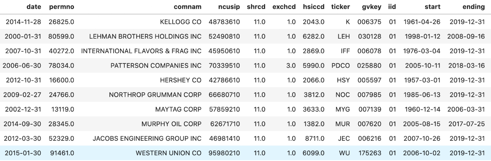

This code illustrates how to get historical S&P 500 index constituents and their identifiers from CRSP and Compustat.

- Researchers used to be able to extract index membership information from Compustat's "comp.idxcst_his" data. Now that S&P pulled this piece of data off from WRDS platform, we have to turn to CRSP to get S&P 500 Index membership data.
- Unfortunately, there is no easy way to uncover constituents info for the other indices covered by "comp.idxcst_his".
- Import Python packages and connect to WRDS

```python
##########################################
# S&P 500 Index Constituents             #
# Qingyi (Freda) Song Drechsler          #
# Date: October 2020                     #
##########################################

import pandas as pd
import wrds

###################
# Connect to WRDS #
###################
conn=wrds.Connection()
```

### 2. Get S&P 500 Index Membership from CRSP

- I opt for the monthly frequency of the data, but one can choose to work with crsp.dsp500list if more precise date range is needed.

```python
sp500 = conn.raw_sql("""
                        select a.*, b.date, b.ret
                        from crsp.msp500list as a,
                        crsp.msf as b
                        where a.permno=b.permno
                        and b.date >= a.start and b.date<= a.ending
                        and b.date>='01/01/2000'
                        order by date;
                        """, date_cols=['start', 'ending', 'date'])
```

### 3. Add Other Company Identifiers from crsp.msenames

- You don't need this step if only PERMNO is required
- This step aims to add TICKER, SHRCD, EXCHCD and etc.

```python
# Add Other Descriptive Variables

mse = conn.raw_sql("""
                        select comnam, ncusip, namedt, nameendt, 
                        permno, shrcd, exchcd, hsiccd, ticker
                        from crsp.msenames
                        """, date_cols=['namedt', 'nameendt'])

# if nameendt is missing then set to today date
mse['nameendt']=mse['nameendt'].fillna(pd.to_datetime('today'))

# Merge with SP500 data
sp500_full = pd.merge(sp500, mse, how = 'left', on = 'permno')

# Impose the date range restrictions
sp500_full = sp500_full.loc[(sp500_full.date>=sp500_full.namedt) \
                            & (sp500_full.date<=sp500_full.nameendt)]
```

### 4. Add Compustat Identifiers

- Link with Compustat's GVKEY and IID if need to work with fundamental data
- Linkage is done through crsp.ccmxpf_linktable

```python
# Linking with Compustat through CCM

ccm=conn.raw_sql("""
                  select gvkey, liid as iid, lpermno as permno, linktype, linkprim, 
                  linkdt, linkenddt
                  from crsp.ccmxpf_linktable
                  where substr(linktype,1,1)='L'
                  and (linkprim ='C' or linkprim='P')
                  """, date_cols=['linkdt', 'linkenddt'])

# if linkenddt is missing then set to today date
ccm['linkenddt']=ccm['linkenddt'].fillna(pd.to_datetime('today'))

# Merge the CCM data with S&P500 data
# First just link by matching PERMNO
sp500ccm = pd.merge(sp500_full, ccm, how='left', on=['permno'])

# Then set link date bounds
sp500ccm = sp500ccm.loc[(sp500ccm['date']>=sp500ccm['linkdt'])\
                        &(sp500ccm['date']<=sp500ccm['linkenddt'])]

# Rearrange columns for final output

sp500ccm = sp500ccm.drop(columns=['namedt', 'nameendt', \
                                  'linktype', 'linkprim', 'linkdt', 'linkenddt'])
sp500ccm = sp500ccm[['date', 'permno', 'comnam', 'ncusip', 'shrcd', 'exchcd', 'hsiccd', 'ticker', \
                     'gvkey', 'iid', 'start', 'ending', 'ret']]
```

### Sample output from the final data frame:


