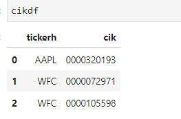
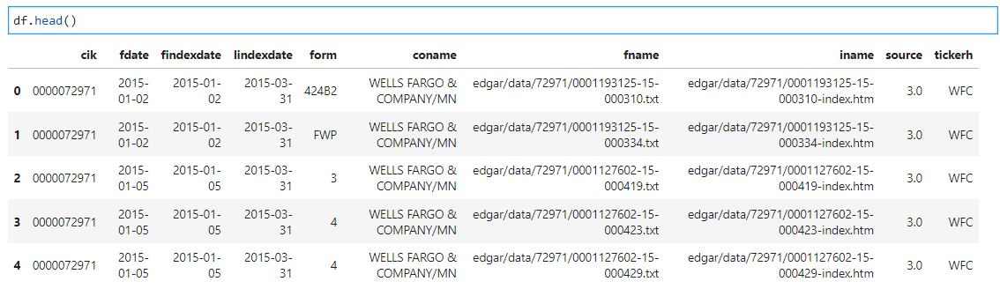
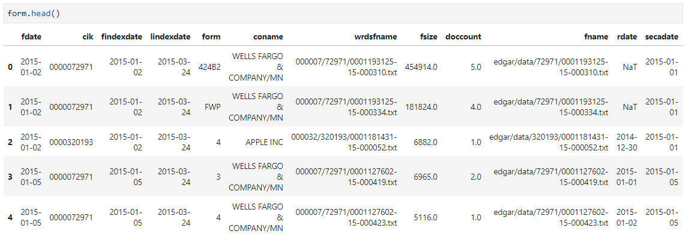
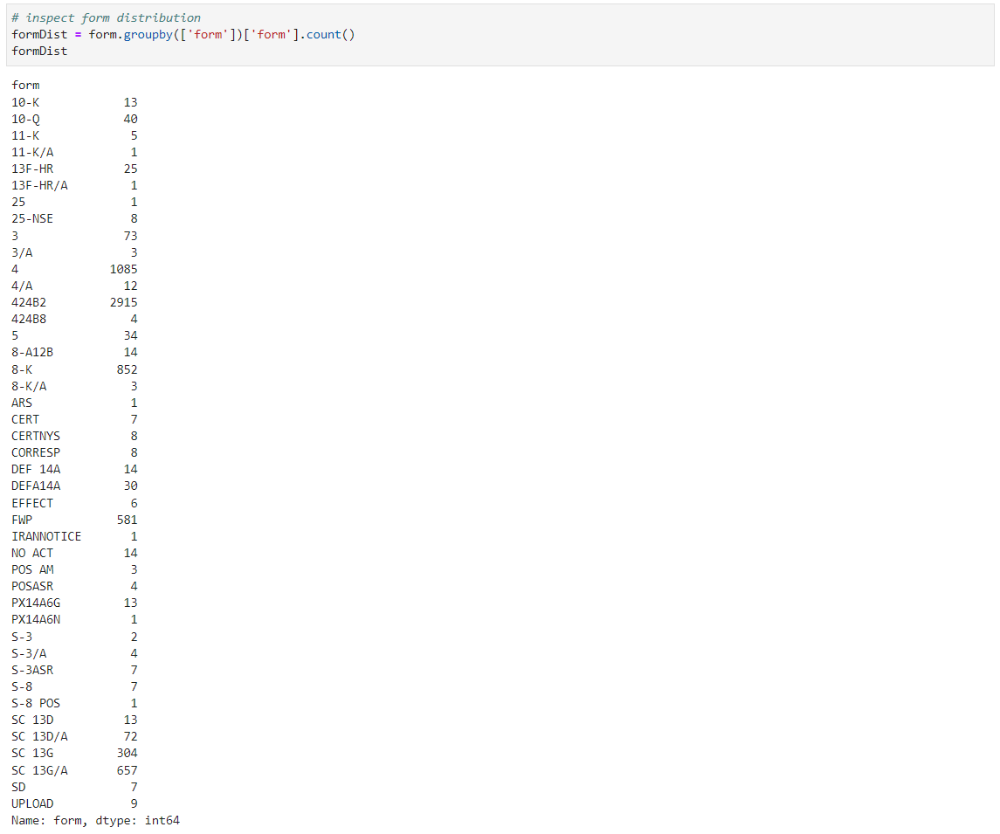
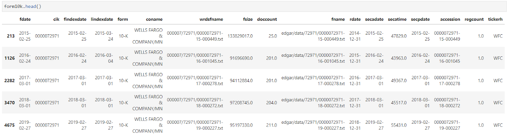
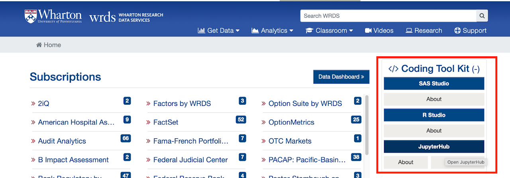
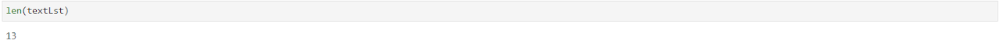
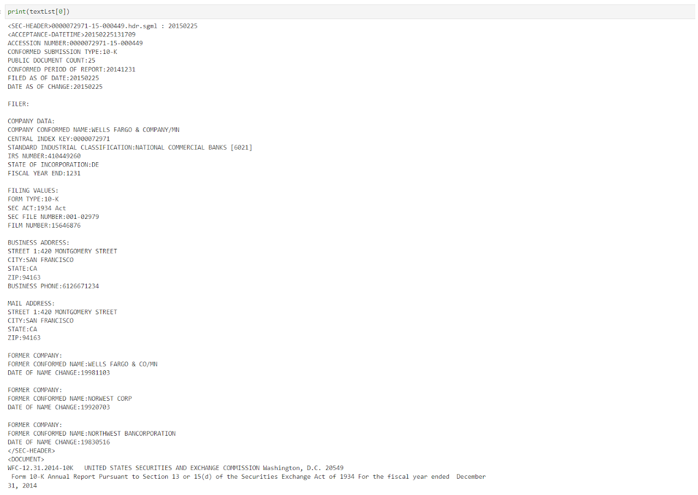

This set of code demonstrates how to access various SEC indices and filings on WRDS SEC tool.

<div class="btn-row"><a class="primary" href="https://drive.google.com/file/d/1Z982DZtokNRxpHI__sF7VipaYTkuaXDm/view?usp=sharing">Full Code</a></div>

Import Python packages and establish connection with WRDS server.

```python
#################################
# Acessing WRDS SEC Filings     #
# Qingyi (Freda) Song Drechsler #
# Date: December 2021           #
#################################

import wrds
import os
import pandas as pd
import numpy as np

# establish connection
conn = wrds.Connection()
```

If you don't already know the data component of the WRDS SEC filings, you may want to explore which tables are part of this library. The most commonly used tables include:

- Linking tables: wciklink_cusip, wciklink_gvkey, wciklink_names
- Filing forms: wrds_forms

```python
# explore table components within wrds sec library
conn.list_tables(library = 'wrdssec')
```

Usage 1: Query Data by Keywords

Occasionally, researchers want to zoom in on certain filings that contain keywords. Taking the insider filings for instance, researchers might want to focus on any insider transaction that is related to Rule 10b5-1. One can parse out the insider filings that contain this keyword by using the code below.

```python
# Note: there are several supplemental WRDS SEC libraries:
# e.g.: wrdssec_insiders
# use sql language to query data

# extract first 1000 observations from insider table that contains '10b5' in text column
footnotes = conn.raw_sql("select * from wrdssec_insiders.footnotes where position('10b5' in text)>0 LIMIT 1000;")
```

The "*where*" statement in the rawl_sql block focuses on records whose "text" column contains the keyword "10b5". Notice the command "*LIMIT 1000*" in the raw_sql statement limits the output to first 1000 records that match the keyword criteria.

And here is the output of the text column of the first record that meets the criteria.

```python
# print out one text entry to inspect
print(footnotes.iloc[0].text)
```

The stock option exercise reported in this Form 4 was effected pursuant to a Rule 10b5-1 trading plan adopted by the reporting person on December 3, 2018.

Usage 2: Query Filing Index by Ticker

This part of the code enables researchers to look up a company's CIK using TICKER, and it further looks up the file name path that point to the actual filings on Edgar's website. WRDS SEC server also mirrors this file path structure.

```python
# Find CIK using company's ticker
ticker = 'AAPL', 'WFC'
begDate = '01/01/2015'
endDate = '12/31/2021'

cikdf = conn.raw_sql(f"""
                    select distinct tickerh, cik
                    from wrdssec.wciklink_names
                    where tickerh in {ticker}
                    """)
```

This raw_sql block looks up the CIKs for two tickers, AAPL and WFC, using the linking table wciklink_names prepared by WRDS research team. The table below shows the content of the cikdf dataframe.



Next, we can use the CIK information to query these two companies' Edgar filing path. One can also impose date range conditions to focus on certain years' filings.

```python
# get the fname and iname information 
# for AAPL and WFC
# during 2015 to 2021 fdate period

df = conn.raw_sql(f"""
                select distinct a.cik, a.fdate, a.findexdate, a.lindexdate, a.form, 
                a.coname, a.fname, a.iname, a.source, b.tickerh
                from wrdssec.forms as a 
                inner join 
                wrdssec.wciklink_names as b
                on a.cik=b.cik
                where b.tickerh in {ticker}
                and a.fdate between '{begDate}' and '{endDate}'
                """, date_cols = ['fdate', 'findexdate', 'lindexdate'])
```

And the output dataframe df contains the following information:



Usage 3: Get Actual Filing Content

For textual analysis projects involving sentiment, readability, topic modelling and many more advanced tasks, researchers need to access the actual SEC filings themselves. WRDS SEC pre-cleans all the SEC filings and has them stored on server for easy access.

```python
# extract form information
# for AAPL and WFC
# from 2015 to 2021

form = conn.raw_sql(f"""
                select distinct a.*, b.tickerh
                from wrdssec.wrds_forms as a 
                inner join 
                wrdssec.wciklink_names as b
                on a.cik=b.cik
                where b.tickerh in {ticker}
                and a.fdate between '{begDate}' and '{endDate}'
                """, date_cols = ['fdate', 'findexdate', 'lindexdate',
                                  'rdate', 'secdate', 'secpdate'])
```



One might notice that under the form column, there are various types of SEC filings, such as Form 3, 4, and many others, in addition to the commonly used 10-K, 10-Q and 8-K filings. As a matter of fact, for the two companies in this example, there are over 40 types of SEC filings.



If one wants to focus on certain type of filing (e.g. 10-K), the operation below filters out all the non 10-K filings and reduces the sample to 13 records.

```python
# focus on specific filings such as 10-Ks

form10k = form.loc[form.form=='10-K']
form10k = form10k.sort_values(by=['cik', 'fdate'])
form10k.shape
```



Last but not least, let's try extract the actual 10-K filings for these two companies. To do so, we will rely on the wrdsfname field in the dataframe above. This variable contains file name and location information for each filing on wrds server under the SEC specific project folder. To complete the file path, we will need to use the os.path.join command below to add on the location of the project folder.

Please note: If you are seeing an error message that "File not on server", it is most likely due to the fact that you are not running the Python code from a WRDS Jupyter environment. To access WRDS JupyterHub, you will need to click on the "Open JupyterHub" icon after logging into WRDS. Once there, the following block of code should run smoothly.



```python
# with wrdsfname info
# read actual filings on wrds server

path = '/wrds/sec/wrds_clean_filings'

# empty text list to store filing content
textLst = []

for item in form10k['wrdsfname']:
    wrdsLoc = os.path.join(path, item)
    try:
        with open(wrdsLoc) as f:
            textLst.append(f.read())
    except:
        print('File not found on server, '+item)
```

The output list textLst should contain the body of the thirteen 10-K filings filed by these two companies in the sample period.



And below is the partial (full content hundreds of pages long) output of the first 10-K filed by WFC on 2015/02/25 for period end 2014/12/31.


