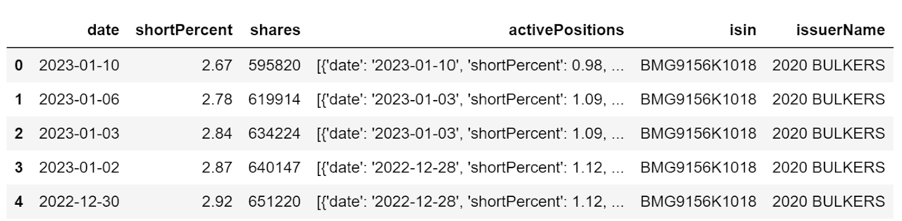
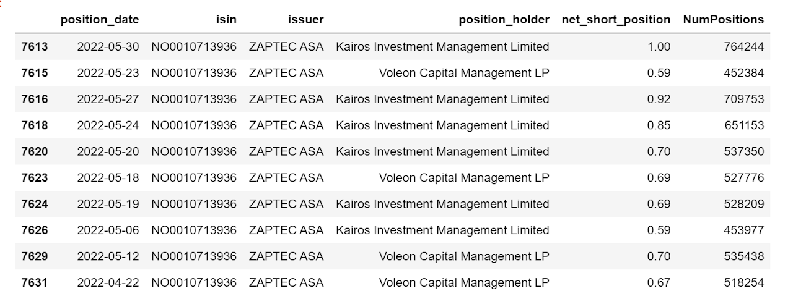

## policy Background

Following the global financial crisis of 2008, European Securities and Markets Authority (ESMA) launched policy EU N236/2012 on short selling and certain aspects of credit default swaps. The purpose of this EU-wide reporting regulation is to increase market stability by reducing the opaqueness of market activities through mandatory daily reporting by institutional investors.

Therefore, each participating country's financial monitoring agency requires market participants with the significant short positions on qualifying securities to self-report the positions, and further makes such information available to the public.

## technical background

As each government agency's website carries the data differently, and often the data scraping exercise involves mimicking the "clicking" action of a mouse, the package Selenium suits the need perfectly.

However, I would like to emphasize here that this code needs human monitoring over time, as government agency's website can change layout or the presented data might show different format. So please do not rely on the code output blindly (more likely it will crash somewhere before getting to the end!).

Our student intern Shuai Zheng contributed to this code.

This code was revamped significantly to reflect the selenium package update as well as changes in the host countries' websites.

Update: May 2024

## code

0. Import packages

```python
#import packages 
from selenium import webdriver
from selenium.webdriver.support.ui import WebDriverWait
from selenium.webdriver.support import expected_conditions as EC
from selenium.webdriver.common.by import By
from selenium.common.exceptions import TimeoutException
from selenium.webdriver.support.ui import Select
from selenium.webdriver.common.by import By
from webdriver_manager.chrome import ChromeDriverManager

import numpy as np
import pandas as pd
import pandas as pd
from tqdm import tqdm
from time import sleep
import glob
import os
import shutil
import pickle as pkl
import time
```

1. Define functions and set up Selenium driver

```python
# Function to wait and show progress
def showProgress(num_max_attempt=10):
    for i in tqdm(range(num_max_attempt), desc='Working on current country: '):
        sleep(.5)

# Function to move and rename file
path_src  = r'your Downloads'
path_dest = r'your descired folder'

# src - raw file downloaded from the govt site
# dest - folder for processing data

def moveAndRename(src, dest):
    src_fname = os.path.join(path_src, src)
    srcfile = glob.glob(src_fname)[0]
    print(srcfile)
    
    dest_fname = os.path.join(path_dest, dest)
    shutil.move(srcfile, dest_fname)
```

Selenium driver set up is slightly tricky. Normally one can use "pip install webdriver-manager" to automatically install the latest version of the chrome driver.

However sometimes when chrome driver is not updated as fast as chrome browser, then the automatic driver initiation will yield error.

Instead user needs to manually download the latest chromedriver from [https://chromedriver.chromium.org/downloads](https://chromedriver.chromium.org/downloads), and then manually assign the driver to the location of the chromedriver.exe from the unzipped download.

```python
# auto initiation that did not work
#driver = webdriver.Chrome(ChromeDriverManager().install())

# manually assign driver
driver = webdriver.Chrome(executable_path = r'your folder\chromedriver.exe')
```

2. Scrape each country's agency site

2.1 Austria

```python
#download data for Austria
print('Working on Austria...')
driver.get("https://webhost.fma.gv.at/ShortSelling/pub/www/QryNetShortPositions.aspx")
assert driver.title=='Netshort positions of shares', 'Webpage has an unexpected title.'

driver.find_element(By.CSS_SELECTOR, '#ctl00_pageMainContent_RadioButtonHistorical').click()
driver.find_element(By.CSS_SELECTOR, '#ctl00_pageMainContent_IDASPButtonDoQuery').click()
driver.find_element(By.CSS_SELECTOR, '#ctl00_pageMainContent_IDASPBtnExcelDownLoad').click()

showProgress()

# Move Austria data
moveAndRename("SHSPosis_*.xls", 'Austria.xls')

print('Done Austria')
```

2.2 Belgium

```python
#download data for Belgium
print('Working on Belgium...')

driver.get('https://www.fsma.be/en/short-selling')

# try accepting cookies
try:
    driver.find_element(By.ID, 'CybotCookiebotDialogBodyLevelButtonLevelOptinAllowallSelection').click()
except:
    print('no cookies to accept')

# open up the box containing "disclosure net short positions"
driver.find_element(By.XPATH, "//h5[contains(text(), 'Disclosure net short positions')]").click()

# click on "Former positions" link
driver.find_element(By.LINK_TEXT, 'Former positions').click()

# click on "Export" button
driver.find_element(By.LINK_TEXT, 'Export').click()

# repeat the same process to go to current data
driver.get('https://www.fsma.be/en/short-selling')

# try accepting cookies
try:
    driver.find_element(By.ID, 'CybotCookiebotDialogBodyLevelButtonLevelOptinAllowallSelection').click()
except:
    print('no cookies to accept')
    
# open up the box containing "disclosure net short positions"
driver.find_element(By.XPATH, "//h5[contains(text(), 'Disclosure net short positions')]").click()

# click on "Current positions"
driver.find_element(By.LINK_TEXT, 'Current positions').click()

# click on "Export" button
driver.find_element(By.LINK_TEXT, 'Export').click()

# Move Belgium data
moveAndRename("de-shortselling.csv", 'Belgium_current.csv')
moveAndRename("de-shortselling-history.csv", 'Belgium_history.csv')
```

2.3 Czech Republic

```python
### Czech's site can't be reached starting in 2022 summer
driver.get('https://www.cnb.cz/en/supervision-financial-market/information-on-short-positions/')
try:
    driver.find_element(By.ID, 's-all-bn').click()
except:
    print('no cookies to accept')
```

2.4 Denmark

```python
print('Working on Denmark...')

driver.get('https://www.dfsa.dk/Rules-and-Practice/Short-selling/Published-net-short-positions')

time.sleep(3)

# find cookies button to accept
try:
    driver.find_element(By.ID, 'CybotCookiebotDialogBodyLevelButtonLevelOptinAllowAll').click()
except:
    print('no cookie to accept')

# get element through text
driver.find_element(By.XPATH, "// a[contains(text(),\
'Here you will find published net short positions at or above 0.5 % of the issued share capital')]").click()

showProgress()
print('Done Denmark')

# move to the destination folder
moveAndRename("*SSover05.xlsx", 'Denmark.xlsx')
```

2.5 Finland

```python
# download data for Finland

print('Working on Finland...')
driver.get('https://www.finanssivalvonta.fi/en/capital-markets/issuers-and-investors/short-positions/')

# Locate Cookie button
try:
    driver.find_element(By.CLASS_NAME, "coi-banner__accept").click()
except:
    print("No cookie to accept")

# click on current positions
driver.find_element(By.LINK_TEXT, 'Current net short positions').click()

driver.implicitly_wait(3)

# Look for "Save as excel (.csv)" button to click on
driver.find_element(By.XPATH, "//button[@class='btn btn-default']").click()

# click on historic positions

driver.find_element(By.PARTIAL_LINK_TEXT, 'Historic positions').click()

# look for 'Save as excel (.csv)' button
driver.find_element(By.XPATH, "//button[@class='btn btn-default']").click()

moveAndRename('shortselling.csv', 'Finland_Current.csv')
moveAndRename('shortselling-history.csv', 'Finland_Historical.csv')
```

2.6 France

```python
#download data for France
print('Working on France...')
driver.get('https://www.amf-france.org/en/news-publications/depth/short-selling')

time.sleep(3)

# find cookie button to select if any
try:
    driver.find_element(By.XPATH, '//button[@class="tarteaucitronCTAButton tarteaucitronAllow"]').click()
except:
    print('no cookie to accept')

driver.find_element(By.LINK_TEXT, "Daily NSP data file (data.gouv.fr website)").click()
showProgress()

print ('Done France')

# Move France data
moveAndRename("export_od_vad*.csv", 'France.csv')
```

2.7 Germany

```python
driver.get('https://www.bundesanzeiger.de/pub/en/to_nlp_start?2')

print(driver.title)
assert driver.title.lower().find('net short position') != -1, 'Webpage has an unexpected title.'

# select Accept all for cookie setting
try:
    driver.find_element(By.ID, "cc_all").click()
except:
    print('no cookie to accept')

# Locate the "More search options" button to click on
more_button = driver.find_element(By.XPATH, '//button[text()="More search options"]').click()

# Locate the "Also find historicised data" checkbox to click on
hist_checkbox = driver.find_element(By.XPATH, '//label[text()="Also find historicised data"]').click()

# Locate the "Search net short positions" button to click on"
search_button = driver.find_element(By.NAME, 'nlp-search-button').click()

# Locate the "Als CSV herunterladen" buton to click on
csv_link = driver.find_element(By.XPATH, '//span[text()="Download as CSV"]').click()

showProgress()

# Move Germany data
moveAndRename("leerverkaeufe_*.csv", 'Germany.csv')
```

2.8 Greece

```python
#download data for Greece
# note: Greek download is deemed unsafe in chrome. Need to manually click on the "keep" button manually while downloading
# otherwise the downloaded file will be saved in a different format that is unopenable using excel
print('Working on Greece...')

driver.get('http://www.hcmc.gr/en_US/web/portal/shortselling1')
assert driver.title=='Short Selling - HCMC', 'Webpage has an unexpected title.'

driver.find_element(By.LINK_TEXT, 'SHORT POSITIONS DISCLOSED TO THE HCMC').click()

showProgress()
print ('Done Greece')
```

2.9 Hungary

```python
#download data for Hungary

print('Working on Hungary...')

driver.get('https://kozzetetelek.mnb.hu/en/short_selling/lekerdezo')
assert driver.title=='MNB Közzétételek', 'Webpage has an unexpected title.'

driver.execute_script('exportToExcel()')

showProgress()

print('Done Hungary')

# Move Hungary data
moveAndRename("lekerdezo.xlsx", 'Hungary.xlsx')
```

2.10 Iceland

```python
#download data for Iceland

print('Working on Iceland...')
driver.get('https://en.fme.is/bitar/fme/short/ShortPositionsExcel.jsp?lang=en')

showProgress()
print('Done Iceland')

# Move Iceland Data
moveAndRename('ShortPositions.xls', 'Iceland.xls')
```

2.11 Ireland

```python
#download data for Ireland

print('Working on Ireland...')
driver.get('https://www.centralbank.ie/regulation/industry-market-sectors/securities-markets/short-selling-regulation/public-net-short-positions')

# need to add the wait time otherwise page does not respond fast enough for cookie click
time.sleep(3)

# find cookie button to accept
try:
    driver.find_element(By.ID, 'onetrust-accept-btn-handler').click()
except:
    print('no cookies to accept')

# Locate href for xls file to click on
# Cannot use href reference as the link name changes with each update

driver.find_element(By.XPATH, '//a[@class="document-download xls"]').click()

showProgress()
print('Done Ireland')

# Move Ireland data
moveAndRename('*able-of-*ignificant*.xls', 'Ireland.xls')
```

2.12 Italy

```python
#download data for Italy

print('Working on Italy...')

driver.get('http://www.consob.it/web/consob-and-its-activities/short-selling')
driver.execute_script('downloadShortselling()')

showProgress()

print('Done Italy')

# Move Italy data
moveAndRename('PncPubbl.xlsx', 'Italy.xlsx')
```

2.13 Luxembourg

```python
#download data for Luxembourg

print('Working on Luxembourg')

driver.get('https://shortselling.apps.cssf.lu/')

# find the "History" link to click on
driver.find_element(By.ID, "HistoryMenu").click()

# find the "Search" button to click on
driver.find_element(By.ID, "button-1074-btnInnerEl").click()

# find the little hardrive icon to click on
driver.find_element(By.ID, "tool-1144-toolEl").click()

showProgress()
print('Done Luxembourg')

# Move Luxembourg data
moveAndRename('_extraction_*.csv', 'Luxembourg.csv')
```

2.14 Netherlands

```python
print('Working on Netherlands...')

# get historical data
driver.get('https://www.afm.nl/en/sector/registers/meldingenregisters/netto-shortposities-historie')

time.sleep(3)

# find cookies button to accept
try:
    driver.find_element(By.ID, 'CybotCookiebotDialogBodyLevelButtonLevelOptinAllowAll').click()
except:
    print('no cookie to accept')

# find link and click on it
csv_link = driver.find_elements(By.XPATH, "//a[@class='cc-simple-link cc-simple-link--download']")[0].click()

# get current data
driver.get('https://www.afm.nl/en/sector/registers/meldingenregisters/netto-shortposities-actueel')

# find link and click on it
csv_link = driver.find_elements(By.XPATH, "//a[@class='cc-simple-link cc-simple-link--download']")[0].click()

print("Done Netherlands")

# Move Netherlands data
moveAndRename('nettoshortpositiesactueel.csv', 'Netherlands_Current.csv')
moveAndRename('nettoshortpositieshistorie.csv', 'Netherlands_Historical.csv')
```

2.15 Poland

```python
#download data for Poland
print('Working on Poland...')
driver.get('https://rss.knf.gov.pl/rss_pub/')

time.sleep(3)

# list of current positions
driver.find_element(By.XPATH,  "//button[@class='btn btn-secondary buttons-excel buttons-html5 btn-default']").click()

# switch to hstorical positions
driver.find_element(By.ID, 'linkToHistory').click()

# list of historical positions
driver.find_element(By.XPATH, "//button[@class='btn btn-secondary buttons-excel buttons-html5 btn-default']").click()

moveAndRename('Lista Pozycji Historycznych RSS.xlsx', 'Poland_Historical.xlsx')
moveAndRename('Lista Pozycji RSS.xlsx', 'Poland_Current.xlsx')

print('Done Poland')
```

2.16 Spain

```python
#download data for Spain
print('Working on Spain...')
driver.get('http://www.cnmv.es/DocPortal/Posiciones-Cortas/NetShortPositions.xls')

showProgress()
print('Done Spain')

# Move Spain data
moveAndRename('NetShortPositions.xls', 'Spain.xls')
```

2.17 Sweden

```python
#download data for Sweden

# Sweden recently lauched new short selling position page
print('Working on Sweden...')
driver.get('https://www.fi.se/en/our-registers/net-short-positions/')

# Look for Current Position link to click on
curr_link = driver.find_elements(By.XPATH, "//a[@id='aktlist']")[0].click()
print('Current Positions:')
showProgress()

# Look for Historical Position link to click on
hist_link = driver.find_elements(By.XPATH, "//a[@id='histlist']")[0].click()
print('Historical Positions:')
showProgress()

print('Done Sweden')

# Move Sweden data
moveAndRename('CurrentPositions.ods', 'Sweden_current.ods')
moveAndRename('HistoricPositions.ods', 'Sweden_historical.ods')
```

2.18 UK

```python
#download data for UK
print('Working on UK...')
driver.get('https://www.fca.org.uk/static/documents/short-positions-daily-update.xls')

showProgress()

print('Done UK')

# Note: file format changed from xls to xlsx
moveAndRename('short-positions-daily-update.xlsx','UK.xlsx')
```

2.19 Norway

Norwegian Finanstilsynet presents the data in the json format through its API portal after the most recent website revamp, therefore the code does not resemble the other countries' download process.

```python
#download data for Norway

# to handle  data retrieval
import urllib3
from urllib3 import request

# to handle certificate verification
import certifi

# to manage json data
import json

http = urllib3.PoolManager(
       cert_reqs='CERT_REQUIRED',
       ca_certs=certifi.where())

# API address for Norway data
url = "https://ssr.finanstilsynet.no/api/v2/instruments"

r = http.request('GET', url)
# 200 means status is normal
r.status

# convert json data into a dict object
data = json.loads(r.data.decode('utf-8'))

# read the json data into dataframe
df = pd.json_normalize(data, 'events', ["isin", "issuerName"], max_level=0)

df.head()
```

The field activePositions is a list of dictionary items that report detail information on short sellers and the respective holdings, and one needs to further open up this field to have a long table that shows each item as a separate row.

While most records show only one item in the activePositions field (i.e. one position holder's record), there are many cases where more than one position holder's records are presented in the activePositions field, organized in a dictionary. And note that the variable shortPercent actually represents the aggregated shortPercent reported by each position holder in that row.



For instance, below is the content of one activePositions:

[{'date': '2023-03-03',

'shortPercent': 0.68,

'shares': 153129,

'positionHolder': 'Voleon Capital Management LP'},

{'date': '2023-03-07',

'shortPercent': 0.89,

'shares': 198486,

'positionHolder': 'WorldQuant LLC'}]

As some of the records report a complete empty activePositions field, I first remove these records from the entire sample and then parse out the position holder information from this field, and then create a new dataframe that contains all the relevant fields.

```python
dfValid = df.loc[df.shares!=0]

# parse out the positionHolder info from the activePositions column
dateLst = []
holderLst = []
shortPctLst = []
shareLst = []
isinLst = []
issuerLst = []

for i in range(dfValid.shape[0]):
    thisIsin = dfValid.iloc[i].isin.__self__.to_dict()['isin']
    thisIssuer = dfValid.iloc[i].issuerName
    # carve out the activePositions 
    item = dfValid.iloc[i].activePositions
    # loop through all components - often more than one 
    for pos in item:
        holderLst.append(pos['positionHolder'])
        shortPctLst.append(pos['shortPercent'])
        dateLst.append(pos['date'])
        shareLst.append(pos['shares'])
        # append isin and issuer for this entire group
        isinLst.append(thisIsin)
        issuerLst.append(thisIssuer)
        

longDf = pd.DataFrame()
longDf['position_date']=dateLst
longDf['isin']=isinLst
longDf['issuer']=issuerLst
longDf['position_holder']=holderLst
longDf['net_short_position']=shortPctLst
longDf['NumPositions']=shareLst
```

Last step is to remove the redundant rows from longDf: the reason is that the json data reports aggregate value by date per row, with each row possibly containing more than one position_holder.

When at least one of the position holders change position, it will lead to update in the aggregate short position, even though the rest of the position holders in that row might not report any changes. With that background in mind, when expanding the position_holders one by one, the ones that do not change positions will get repopulated day after day and therefore appear in duplicate records.

```python
longDf = longDf.drop_duplicates()
```

And the final output for Norway looks like the following:



Done with all countries raw data scraping
